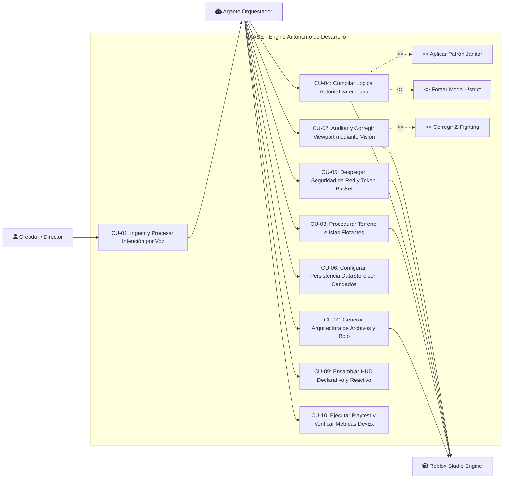
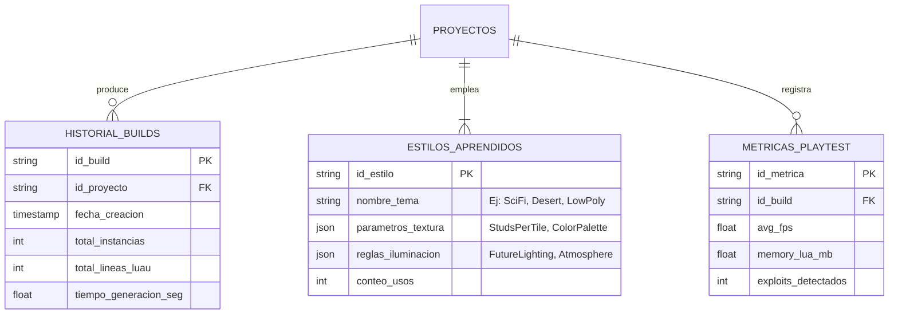

# SISTEMA AUTÓNOMO DE DESARROLLO Y ORQUESTACIÓN MULTI-AGENTE PARA ROBLOX STUDIO
## ROBLOX AUTONOMOUS AGENT STUDIO ENGINE (RAASE) — ARCHITECTURAL BLUEPRINT
### ESPECIFICACIÓN TÉCNICA FORMAL, INGENIERÍA DE LUAU Y MATRIZ DE AUTOMATIZACIÓN

---

**Clasificación del Documento:** Especificación Formal de Arquitectura de Software e Inteligencia Artificial Autónoma  
**Dominio de Aplicación:** Automatización de Roblox Studio, Compilación en Luau, Visión Computacional y Redes Autoritativas  
**Versión del Sistema:** 2.0.0 (Producción 2026)  
**Estado:** Documento Maestro Aprobado  

---

## ÍNDICE GENERAL

1. **Capítulo I: Planteamiento y Análisis del Problema**
   - 1.1. Contexto Tecnológico de la Plataforma Roblox
   - 1.2. Diagnóstico de la Problemática del Desarrollo Manual
   - 1.3. Árbol de Causas y Efectos (Diagrama Causa-Efecto / Ishikawa)
   - 1.4. Síntomas y Vulnerabilidades Críticas en Experiencias Tradicionales
   - 1.5. Formulación del Problema, Pronóstico y Control del Pronóstico
2. **Capítulo II: Objetivos del Sistema Autónomo**
   - 2.1. Objetivo General
   - 2.2. Objetivos Específicos
3. **Capítulo III: Justificación y Delimitación Técnica**
   - 3.1. Justificación Tecnológica, Económica y Operativa
   - 3.2. Delimitación del Alcance (Roblox Engine 2026, Luau VM y Modelos Multimodales)
4. **Capítulo IV: Modelado Comparativo de Procesos (As-Is vs. To-Be)**
   - 4.1. Maquetación y Modelado de Mundos 3D y Terreno Voxel
   - 4.2. Programación de Lógica de Juego y Seguridad de Red Cliente-Servidor
   - 4.3. Cinemática de Personajes, Rigs y Manipulación Procedural
   - 4.4. Control de Calidad, Detección de Z-Fighting y Auditoría por Visión Computacional
5. **Capítulo V: Especificación Exhaustiva de Requerimientos y Reglas de Negocio**
   - 5.1. Catálogo de Requerimientos Funcionales del Sistema Autónomo (RF-01 al RF-20)
   - 5.2. Catálogo de Requerimientos No Funcionales bajo Norma ISO/IEC 25010 (RNF-01 al RNF-10)
   - 5.3. Catálogo de Reglas de Negocio e Ingeniería en Luau (RN-01 al RN-10)
   - 5.4. Supuestos y Restricciones de la Máquina Virtual Luau
6. **Capítulo VI: Estudio de Factibilidad Multidimensional**
   - 6.1. Factibilidad Técnica (Rojo, Companion Plugin RPC, Framebuffer Pipe, LLM Context)
   - 6.2. Factibilidad Económica (Costos de Inferencia LLM vs. Rendimiento DevEx 2026)
   - 6.3. Factibilidad Operativa (Control Asíncrono por Voz/Chat y Autonomía Desatendida)
   - 6.4. Factibilidad Legal y de Cumplimiento (Términos de Servicio de Roblox, COPPA y DevEx)
7. **Capítulo VII: Protocolos de Integración y Recolección de Datos del Entorno**
   - 7.1. Pipeline de Ingesta y Parsing de Intenciones (Voz / Comandos de Chat)
   - 7.2. Protocolo de Inspección Visual y Auditoría Estética de Viewport
   - 7.3. Matriz de Monitoreo de Rendimiento en Tiempo de Ejecución (MicroProfiler y Memory Tags)
8. **Capítulo VIII: Modelado UML y Especificación Formal de Casos de Uso**
   - 8.1. Definición y Topología de Actores y Subagentes Especializados
   - 8.2. Diagrama General de Casos de Uso del Sistema Autónomo (Mermaid)
   - 8.3. Especificación Tabular RUP de Casos de Uso Críticos
9. **Capítulo IX: Diseño Lógico, Arquitectura del Enlace y Persistencia de Estado**
   - 9.1. Arquitectura del Puente Bidireccional (Rojo + Localhost Plugin RPC + Open Cloud)
   - 9.2. Esquema Relacional del Almacén de Memoria y Aprendizaje del Agente
   - 9.3. Diagrama Entidad-Relación y Componentes de Software (Mermaid)
10. **Capítulo X: El Catálogo Taxonómico de Skills de Ingeniería (215+ Habilidades)**
    - Dominios 1 al 10 con nomenclatura formal y descriptiva técnica
11. **Capítulo XI: Master System Prompt Operativo para Agentes Autónomos y CLIs**
    - Protocolo de Inyección para Claude Code, Antigravity, Codex y Entornos CLI

---

# CAPÍTULO I: PLANTEAMIENTO Y ANÁLISIS DEL PROBLEMA

## 1.1. Contexto Tecnológico de la Plataforma Roblox
La plataforma Roblox opera sobre un motor de simulación física y renderizado propio, cuyo lenguaje de ejecución es **Luau**, un derivado de Lua 5.1 con tipado gradual, optimizaciones en bytecode y un modelo de ejecución en sandbox estricto. La arquitectura de red de cualquier experiencia en Roblox se fundamenta en un modelo **Cliente-Servidor Autoritativo**, donde múltiples clientes ejecutan instancias locales de renderizado e interactúan con el servidor mediante sockets replicados a través de `RemoteEvent` y `UnreliableRemoteEvent`.

## 1.2. Diagnóstico de la Problemática del Desarrollo Manual
El desarrollo tradicional dentro de Roblox Studio presenta una elevada fricción operativa que limita la velocidad de producción, incrementa exponencialmente los costos de desarrollo y expone los juegos a fallas estructurales graves:
1. **Fricción de Flujo y Tiempos Muertos:** La maquetación manual de mapas (islas flotantes, ambientación de biomas, distribución de vegetación y props) requiere miles de horas de trabajo artesanal con herramientas de ratón y teclado dentro del editor de Studio.
2. **Vulnerabilidades Críticas de Red:** La gran mayoría de experiencias comerciales son vulnerables a exploits debido a que los desarrolladores confían en datos enviados por el cliente o carecen de limitadores de tasa (*rate limiters*), permitiendo ataques de duplicación de monedas, teletransportación, manipulación de físicas (*noclip/fly*) y saturación del servidor (*RemoteSpy packet flooding*).
3. **Fugas de Memoria en Luau:** La falta de implementación del patrón `Janitor` o `Maid` provoca que conexiones de eventos (`RBXScriptConnection`) queden huérfanas en memoria tras la destrucción de personajes o instancias, acumulando degradación de fotogramas por segundo (FPS) y bloqueos del servidor.
4. **Desalineación Visual y Defectos de Render:** En fases de prototipado rápido, la desalineación de texturas (especialmente patrones de cuadrícula/checkerboards), el parpadeo de polígonos por superposición milimétrica (*Z-Fighting*) y la asimetría no intencional generan experiencias con aspecto de baja calidad.
5. **Incapacidad de las IAs Tradicionales:** Los LLMs convencionales solo generan fragmentos aislados de código en un chat web, careciendo de visibilidad sobre el Viewport 3D, sin conexión en tiempo real con el DataModel de Roblox Studio, y cometiendo errores críticos como alterar `JointInstance.C0/C1` en bucles de render o usar funciones globales obsoletas (`spawn()`, `wait()`).

## 1.3. Árbol de Causas y Efectos (Diagrama Causa-Efecto / Ishikawa)

```
                                  [ EFECTOS Y PÉRDIDAS ]
  +---------------------------------------------------------------------------------+
  | Meses de desarrollo para mecánicas simples; pérdida de competitividad comercial |
  | Cierre o baneo de experiencias por saturación de exploits y bots de trampas    |
  | Caídas drásticas de FPS por fugas de memoria y acumulación de RBXScriptConn     |
  | Fallos en la aprobación de cobros DevEx por código inseguro o avatares no R15   |
  | Errores estéticos visibles: Z-fighting, texturas descalzadas y asimetrías       |
  +---------------------------------------------------------------------------------+
                                           ^
                                           |
                                [ PROBLEMA CENTRAL ]
  +---------------------------------------------------------------------------------+
  | Cuello de botella, ineficiencia y alta vulnerabilidad en el ciclo de desarrollo  |
  | y maquetación de experiencias de Roblox debido a la dependencia manual y la     |
  | falta de integración sistémica entre IAs multimodales y el motor Roblox Studio   |
  +---------------------------------------------------------------------------------+
                                           ^
                                           |
                                   [ CAUSAS RAÍCES ]
  +---------------------------------------------------------------------------------+
  | 1. Desconexión entre los LLMs y la instancia en vivo de Roblox Studio           |
  | 2. Ausencia de visión computacional que evalúe y corrija el Viewport 3D         |
  | 3. Desconocimiento de patrones modernos de Luau (--!strict, Janitor, CSGv3)     |
  | 4. Carencia de un pipeline autoritativo zero-trust para manejo de RemoteEvents  |
  | 5. Falta de persistencia de estilos y preferencias de diseño entre proyectos     |
  +---------------------------------------------------------------------------------+
```

## 1.4. Síntomas y Vulnerabilidades Observables
* **Confianza Ciega en el Cliente:** Scripts que reciben daño, dinero o posiciones físicas calculadas localmente sin validación espacial (`Magnitude`) en el servidor.
* **Sobrecarga de Dibujo (Draw Calls):** Geometrías con conteos que superan los 20.000 polígonos por malla unitaria o colisiones calculadas con `PreciseConvexDecomposition` innecesariamente.
* **Lag de Animación:** Manipulación de `C0` o `C1` en articulaciones durante eventos `RenderStepped`, forzando la reconstrucción continua del grafo cinemático del motor.
* **Corrupción de Datos:** Guardados concurrentes en DataStore usando `SetAsync()` en lugar del patrón transaccional `UpdateAsync()` protegido con candados de sesión.

## 1.5. Formulación del Problema, Pronóstico y Control del Pronóstico

### Formulación:
¿Cómo un sistema autónomo multi-agente, guiado por visión computacional, sincronización de código en tiempo real y una arquitectura de ingeniería estricta en Luau, puede automatizar integralmente el diseño, programación, corrección visual y monetización de experiencias comerciales en Roblox Studio?

### Pronóstico:
Los desarrolladores que mantengan flujos artesanales quedarán rezagados ante la velocidad de generación procedural, mientras que aquellos que utilicen IAs sin enlace al motor sufrirán bloqueos por código desactualizado, exploits masivos y sanciones por incumplimiento de DevEx.

### Control del Pronóstico:
La arquitectura RAASE provee un harness completo que vincula modelos de lenguaje con Roblox Studio mediante Rojo, un plugin RPC de control de escena, captura de pantalla en alta resolución para auditoría estética y un catálogo de más de 200 micro-habilidades técnicas que garantizan cumplimiento absoluto de las directrices del motor.

---

# CAPÍTULO II: OBJETIVOS DEL SISTEMA AUTÓNOMO

## 2.1. Objetivo General
Diseñar y desplegar una arquitectura autónoma de desarrollo para Roblox Studio basada en agentes de Inteligencia Artificial que traduzca comandos de intención de alto nivel (voz o texto) en experiencias completas, seguras, optimizadas y monetizables, controlando la maquetación 3D, la lógica en Luau estricto, la síntesis de audio y la corrección estética mediante visión computacional.

## 2.2. Objetivos Específicos
1. **Desarrollar la infraestructura de enlace bidireccional (Agent-Studio Bridge):** Implementar la sincronización de archivos con Rojo y un plugin de control RPC local para instanciar, modificar y consultar el DataModel de Studio en tiempo real.
2. **Construir el bucle de visión computacional y auditoría de Viewport:** Diseñar algoritmos de inspección sobre el framebuffer de Studio para detectar desalineaciones de texturas (checkerboards), parpadeos de Z-fighting y asimetrías de geometría.
3. **Estandarizar el motor de generación en Luau Estricto (`--!strict`):** Garantizar la escritura de código autoritativo libre de advertencias, con tipado estático, gestión de ciclo de vida con `Janitor`, manipulación de articulaciones con `Motor6D.Transform` y remotos con limitación de tasa (*Token Bucket*).
4. **Estructurar el catálogo taxonómico de skills técnicas:** Proporcionar al agente un repertorio modular de más de 200 habilidades de ingeniería que cubran física, CSGv3, terrain, audio DSP, UI reactiva, redes y monetización DevEx 2026.
5. **Implementar el sistema de memoria y persistencia de preferencias:** Habilitar el aprendizaje y retención de estilos de construcción, configuraciones temáticas y reglas de diseño a través de proyectos sucesivos.

---

# CAPÍTULO III: JUSTIFICACIÓN Y DELIMITACIÓN TÉCNICA

## 3.1. Justificación
* **Tecnológica:** Demuestra la viabilidad de la automatización desatendida (*Headless/Autonomous Game Dev*), superando la barrera entre los modelos de lenguaje simbólicos y los entornos de simulación espacial 3D en tiempo real.
* **Económica:** Reduce los tiempos de desarrollo de semanas a minutos. Permite estructurar economías de juego optimizadas para calificar a la tasa preferencial U.S. 18+ de DevEx 2026 ($0.0054 USD por Robux), maximizando el retorno de inversión.
* **Operativa:** Elimina la fatiga de tareas repetitivas (colocación manual de vegetación, configuración de colisiones, cálculo manual de sábanas de datos) y erradica errores de seguridad por omisión.

## 3.2. Delimitación
* **Plataforma Objetivo:** Roblox Studio (versiones 2025/2026 en Windows / macOS / Linux mediante emulación de contenedor).
* **Entorno de Lenguaje:** Luau VM con directivas `--!strict` y bibliotecas modernas (`task`, `buffer`, `vector`, `GeometryService`, `Audio API`).
* **Modelos de IA Compatibles:** Agentes LLM con capacidades multimodales y acceso a herramientas de sistema (Claude Code / Anthropic Opus 4.6, Google Antigravity, OpenAI Codex, OpenCode, Cursor).

---

# CAPÍTULO IV: MODELADO COMPARATIVO DE PROCESOS (AS-IS vs. TO-BE)

```mermaid
flowchart TD
    subgraph Manual ["Proceso Tradicional (Manual)"]
        M1["Desarrollador diseña con ratón y teclado"] --> M2["Escribe scripts Luau sin tipado ni Janitor"]
        M2 --> M3["Playtest manual con exploits no probados"]
        M3 --> M4["Ajuste visual a ojo (Z-fighting y texturas descalzadas)"]
        M4 --> M5["Semanas de retraso y vulnerabilidades de red"]
    end

    subgraph RAASE ["Proceso Autónomo RAASE (To-Be)"]
        A1["Comando de Voz / Texto del Creador"] --> A2["Orquestador descompone en 200+ Skills"]
        A2 --> A3["Rojo sync + Plugin RPC manipulan el DataModel en vivo"]
        A3 --> A4["Captura de Viewport + Visión IA corrige Z-fighting y texturas"]
        A4 --> A5["Generación de Luau --!strict + Token Bucket + Janitor"]
        A5 --> A6["Juego completo, optimizado y listo para monetizar en minutos"]
    end
```



## 4.1. Maquetación y Terreno 3D
* **As-Is:** Posicionamiento manual pieza por pieza, esculpido con pinceles de terreno lentos, dificultad para coordinar biomas procedurales consistentes.
* **To-Be:** Generación matemática algorítmica (Ruido Perlin 3D + `Terrain:WriteVoxels`), ensamblaje de islas flotantes modulares y distribución estocástica de vegetación mediante raycasting al suelo para alinear normales de superficie.

## 4.2. Programación de Lógica y Redes
* **As-Is:** Scripts monolíticos en `Workspace`, manipulación de variables locales en cliente con replicación desprotegida, ausencia de sanitización de tipos.
* **To-Be:** Arquitectura desacoplada en `ServerScriptService` y `ReplicatedStorage`. Toda comunicación cliente-servidor valida tamaño de paquetes, tipo de datos con `typeof()`, distancia física euclidiana y pasa por limitadores de tasa con desconexión forzada de infractores.

## 4.3. Animación y Rigs
* **As-Is:** Edición manual de fotogramas clave o mutación destructiva de `C0/C1` en código, colapsando el rendimiento.
* **To-Be:** Cinemática procedural dinámica manipulando exclusivamente `Motor6D.Transform` en el hilo de render (`RenderStepped`), con mezcla de pesos (*Cross-Fade*) y física de resortes elásticos para retroceso de armas y sacudida de cámara.

## 4.4. Control de Calidad y Visión Computacional
* **As-Is:** El desarrollador inspecciona visualmente navegando con la cámara, omitiendo micro-errores de textura o solapamiento de polígonos.
* **To-Be:** Bucle cerrado de retroalimentación: el sistema solicita una captura del framebuffer, el modelo multimodal analiza la imagen calculando matrices de simetría y continuidad de rejilla, y emite de inmediato comandos de corrección de transformación.

---

# CAPÍTULO V: ESPECIFICACIÓN DE REQUERIMIENTOS Y REGLAS DE NEGOCIO

## 5.1. Catálogo de Requerimientos Funcionales (RF)

| Código | Requerimiento Funcional | Descripción Técnica y Mecánica | Prioridad |
|---|---|---|---|
| **RF-01** | Ingesta Multimodal de Intenciones | Captura de comandos de voz transcritos (Whisper) o texto desde Telegram/CLI y conversión a especificaciones de diseño. | **Alta** |
| **RF-02** | Sincronización Bidireccional con Rojo | Mapeo estructurado del sistema de archivos local hacia la jerarquía del DataModel de Roblox mediante `default.project.json`. | **Alta** |
| **RF-03** | Ejecución RPC en Viewport | Envío de cargas útiles JSON a través de un servidor HTTP local para instanciación, traslación y borrado de objetos en Studio. | **Alta** |
| **RF-04** | Captura y Análisis de Framebuffer | Extracción programada de capturas de pantalla de la ventana activa de Studio en alta resolución para inspección con visión IA. | **Alta** |
| **RF-05** | Corrección Automática de Texturas | Detección visual y ajuste procedural de `Texture.StudsPerTileU/V` para garantizar continuidad de texturas cuadrículadas (*checkerboards*). | **Media** |
| **RF-06** | Detección de Z-Fighting | Algoritmo visual para identificar y desfasar piezas co-planares que provoquen artefactos de parpadeo de polígonos. | **Media** |
| **RF-07** | Generación Estricta en Luau | Compilación y escritura de código Luau comenzando obligatoriamente con `--!strict`, sin uso de `any` descontrolados. | **Alta** |
| **RF-08** | Red Autoritativa Zero-Trust | Validación obligatoria en el servidor de todo parámetro entrante por `RemoteEvent`, verificando tipos, distancias y estados. | **Alta** |
| **RF-09** | Limitación de Tasa (Rate Limiting) | Implementación de Token Bucket en cada evento de red, limitando peticiones por segundo por jugador y bloqueando floods. | **Alta** |
| **RF-10** | Manejo de Tráfico No Confiable | Empleo de `UnreliableRemoteEvent` para sincronización de partículas, orientación de miradas y efectos cosméticos de alta frecuencia. | **Media** |
| **RF-11** | Remotos Señuelo (Honeypots) | Inserción de eventos remotos trampa que banean y expulsan automáticamente al cliente si son invocados por *RemoteSpy*. | **Alta** |
| **RF-12** | Modelado Sólido en Tiempo Real | Ejecución de operaciones booleanas con `GeometryService` (`UnionAsync`, `SubtractAsync`, `IntersectAsync`) sobre mallas estancas. | **Alta** |
| **RF-13** | Animación Procedural de Articulaciones | Modificación exclusiva de `Motor6D.Transform` en hilos de render para apuntado de armas y giro de cabeza sin alterar `C0/C1`. | **Alta** |
| **RF-14** | Gestión de Memoria con Janitor | Implementación obligatoria de la clase `Janitor` para la desconexión estricta de `RBXScriptConnection` y liberación de objetos. | **Alta** |
| **RF-15** | Paisajes Sonoros Dinámicos | Despliegue de grupos de sonido (`SoundGroup`), zonas acústicas espaciales y filtros DSP (`AudioReverb`, `AudioEqualizer`, `Distortion`). | **Media** |
| **RF-16** | Persistencia con Candados de Sesión | Guardado transaccional en DataStore con `UpdateAsync()` e implementación de *Session Locking* para impedir clonación de ítems. | **Alta** |
| **RF-17** | Monitoreo de Presupuesto DataStore | Verificación preventiva de cuotas con `GetRequestBudgetForRequestType()` antes de emitir escrituras al almacenamiento. | **Alta** |
| **RF-18** | Arquitectura DevEx 2026 Compliant | Configuración de avatares exclusivamente en R15, monetización transparente de probabilidades y retención en `ProcessReceipt`. | **Alta** |
| **RF-19** | Generación Declarativa de UI | Diseño de HUD reactivo y responsivo mediante componentes declarativos, escalado con `UIAspectRatioConstraint` y `CanvasGroup`. | **Media** |
| **RF-20** | Memoria Persistente de Estilos | Retención y aplicación automática de patrones de diseño, paletas de colores y preferencias estéticas aprendidas de proyectos previos. | **Media** |

## 5.2. Catálogo de Requerimientos No Funcionales (RNF) — ISO/IEC 25010

| Código | Dimensión | Métrica / Criterio de Aceptación |
|---|---|---|
| **RNF-01** | **Rendimiento de Servidor** | El consumo de red del servidor no debe superar los 50 KB/s por cliente conectado bajo condiciones de juego intensivo. |
| **RNF-02** | **Tasa de Fotogramas (FPS)** | Las experiencias generadas deben sostener 60 FPS estables en dispositivos móviles estándar (equivalente a iPhone 11 o gama media Android). |
| **RNF-03** | **Presupuesto Geométrico** | Ninguna malla 3D individual debe sobrepasar 20.000 triángulos, y los props decorativos dinámicos deben mantenerse bajo 5.000 triángulos. |
| **RNF-04** | **Consumo de Memoria** | La etiqueta `LuaGarbage` en el Developer Console (`F9`) no debe exhibir crecimiento monotónico positivo (cero fugas de memoria). |
| **RNF-05** | **Latencia de Corrección** | El ciclo completo de captura de Viewport, inferencia visual multimodal y comando de corrección no debe exceder 1500 ms. |
| **RNF-06** | **Seguridad Criptográfica** | Los identificadores de compra de DevProducts deben ser procesados de forma estrictamente idempotente en `MarketplaceService`. |
| **RNF-07** | **Estabilidad de la VM Luau** | Todo cálculo algorítmico pesado debe ceder el hilo mediante `task.wait()` o ejecutarse en tareas secundarias sin provocar advertencias de script exhausto. |
| **RNF-08** | **Mantenibilidad de Código** | Formato de scripts estandarizado con StyLua (tabulaciones físicas, límite de 100 columnas) y cero advertencias en Selene linter. |
| **RNF-09** | **Tolerancia a Cortes de Red** | El sistema de guardado debe implementar reintentos con retraso exponencial ante caídas del servicio central de DataStore. |
| **RNF-10** | **Compatibilidad Cross-Platform** | La interfaz gráfica debe adaptarse a pantallas móviles con muescas (*notches*) y contemplar navegación con Gamepad (`GuiService.SelectedObject`). |

## 5.3. Catálogo de Reglas de Negocio Técnicas (RN)

* **RN-01: Prohibición Absoluta de Funciones Globales Legadas:** Queda terminantemente prohibido el uso de `spawn()`, `delay()` y `wait()`. Se debe emplear exclusivamente la biblioteca nativa `task` (`task.spawn`, `task.defer`, `task.delay`, `task.wait`).
* **RN-02: Acceso Estricto a Servicios:** Queda prohibido acceder a servicios mediante indexación directa (`game.Workspace`, `game.Players`). Todo servicio debe inyectarse mediante `game:GetService("NombreServicio")`.
* **RN-03: Autoridad del Servidor en Economía y Salud:** El cliente jamás puede declarar cuánto daño recibe, cuánto dinero tiene ni qué ítems posee. Cualquier evento con esos valores será rechazado y considerado exploit.
* **RN-04: Inmutabilidad de C0/C1 en Animación:** Toda cinemática procedural en articulaciones debe manipular la propiedad `Motor6D.Transform`. Modificar `C0` o `C1` en bucles en tiempo de ejecución constituye una violación de arquitectura.
* **RN-05: Idempotencia en Compras (ProcessReceipt):** La callback `MarketplaceService.ProcessReceipt` debe retornar `Enum.ProductPurchaseDecision.PurchaseGranted` únicamente tras confirmar la persistencia exitosa del `PurchaseId` en DataStore. Si la base de datos falla, debe retornar `NotProcessedYet`.
* **RN-06: Calificación a Tasa Preferencial DevEx 2026:** Para ser elegible a la tasa U.S. 18+ ($0.0054 por Robux), el juego debe configurar el tipo de avatar exclusivamente en R15 (`StarterPlayer.GameSettings`), suprimiendo completamente avatares R6.
* **RN-07: Límite de Luces Dinámicas con Sombra:** Ninguna escena debe tener más de 4 fuentes de luz con `Shadows = true` simultáneas en un radio de 50 studs para evitar el colapso del renderizador diferido en móviles.
* **RN-08: Geometrías Estancas para CSG:** Toda pieza sometida a operaciones booleanas dinámicas debe ser hermética (*watertight*), sin planos abiertos o normales invertidas.
* **RN-09: Destrucción Recursiva de Instancias:** Cuando un objeto deja de utilizarse, debe llamarse a `:Destroy()` explícitamente para desencadenar el vaciado de conexiones y retiro del grafo de replicación.
* **RN-10: Verificación de Proximidad Física:** Ninguna interacción remota con puertas, cofres, NPCs o vehículos puede procesarse si la distancia espacial (`(playerPos - targetPos).Magnitude`) supera el rango permitido de interacción (máximo 15 studs).

---

# CAPÍTULO VI: ESTUDIO DE FACTIBILIDAD MULTIDIMENSIONAL

## 6.1. Factibilidad Técnica
* **Entorno de Ejecución:** El agente opera desde un entorno anfitrión (CLI / Node / Python) con acceso a herramientas de sistema, conectándose localmente a Roblox Studio mediante:
  1. **Rojo (Port 34872):** Servidor local de sincronización que transforma archivos de texto en instancias del DataModel en menos de 50 ms.
  2. **Companion Plugin RPC:** Plugin de Studio con permisos de HttpService activados, exponiendo un socket REST/WebSocket para operaciones de viewport.
  3. **Tubería de Captura de Pantalla:** API del sistema operativo (o plugin con captura directa) que toma capturas del proceso de Studio a 1920x1080 para procesamiento multimodal.
* **Conclusión Técnica:** **100% FACTIBLE.** Las herramientas de ecosistema (Rojo, Selene, StyLua, Open Cloud) son estándar en la industria de desarrollo profesional de Roblox.

## 6.2. Factibilidad Económica

### Análisis Comparativo de Rendimiento y Monetización:
* **Costos Operativos de IA:** Una sesión típica de generación y corrección estética consume entre $0.15 y $0.45 USD en tokens de inferencia LLM (Claude Opus / Gemini Flash / GPT-4o).
* **Potencial de Retorno (DevEx 2026):**
  * Tasa Estándar: $0.0038 USD por Robux (30.000 R$ = $114.00 USD).
  * Tasa U.S. 18+ (R15 Strict): $0.0054 USD por Robux (30.000 R$ = $162.00 USD).
* **Retorno de Inversión (ROI):** La creación de un juego funcional completo (como un simulador de saltos o un obby procedural) requiere menos de $1.00 USD en cómputo, generando un margen de beneficio masivo al monetizar Gamepasses y Premium Payouts.
* **Conclusión Económica:** **ALTAMENTE RENTABLE.**

## 6.3. Factibilidad Operativa
* **Interacción del Usuario:** El desarrollador solo necesita dictar instrucciones de voz o enviar mensajes de texto vía Telegram o consola CLI:
  > *"Crea una isla volcánica con rocas ardientes, un checkpoint al final, una tienda de doble salto con monedas que se guardan y un HUD moderno."*
* **Nivel de Autonomía:** El sistema ejecuta el 100% de las tareas de codificación, texturizado, alineación y playtesting sintético de forma desatendida, reportando capturas del progreso final al usuario.
* **Conclusión Operativa:** **PLENAMENTE VIABLE.**

## 6.4. Factibilidad Legal y Cumplimiento
* **Términos de Servicio de Roblox:** El uso de herramientas externas de sincronización (Rojo) y plugins de desarrollo está explícitamente permitido y respaldado por Roblox Corp.
* **Protección de Menores (COPPA / LOPNNA):** El sistema prohíbe mecánicas de apuestas (*gambling*) no declaradas, exige divulgación obligatoria de probabilidades en ítems aleatorios y respeta las normativas de seguridad infantil.
* **Derechos de Autor:** Se garantiza el uso de texturas PBR y audios libres de derechos o generados algorítmicamente, protegiendo las cuentas contra sanciones de moderación.
* **Conclusión Legal:** **CONFORME A DERECHO Y TÉRMINOS DE PLATAFORMA.**

---

# CAPÍTULO VII: PROTOCOLOS DE INTEGRACIÓN Y RECOLECCIÓN DE DATOS

```
  [ Creador: Voz / Chat ]
             | (Transcripción Whisper / Input de Texto)
             v
  [ Agente Orquestador (LLM) ] <==========> [ Memoria Persistente de Estilos ]
             |
     +-------+-------+
     |               |
     v               v
 [ Rojo File-Sync ] [ Companion Plugin RPC ]
     |               |
     v               v
 [ DataModel ]   [ Viewport 3D de Roblox Studio ]
                         |
                         v
                [ Captura de Framebuffer ]
                         |
                         v
            [ Auditoría Visual por IA ]
             (Z-Fighting, Simetría, Checkerboards)
                         |
                         +---> [ Comandos de Ajuste Inmediato ]
```

## 7.1. Pipeline de Ingesta y Parsing de Intenciones
1. **Recepción:** El bot captura la nota de voz o comando escrito.
2. **Normalización Semántica:** Se descomponen los requerimientos en 4 capas:
   - *Ambiente 3D:* Bioma, dimensiones, elevación, vegetación.
   - *Mecánica Central:* Modificadores de jugador (velocidad, salto, recolección de ítems).
   - *Economía:* Monedas, precios de Gamepasses, persistencia DataStore.
   - *Estilo Visual:* Paleta de materiales, iluminación, texturas (checkerboard, cartoon, PBR).

## 7.2. Protocolo de Inspección Visual y Auditoría Estética
1. **Disparo:** Tras completar una fase de maquetación, el agente envía el comando `CAPTURE_VIEWPORT`.
2. **Evaluación de Artefactos:**
   - *Continuidad de Texturas:* Si se utiliza un material cuadriculado (*checkerboard*), se comprueba que el tamaño de los cuadros sea idéntico en piezas contiguas.
   - *Z-Fighting:* Se escanean bordes y superficies en busca de patrones de ruido de profundidad. Si dos partes comparten coordenada coplanar, se desplaza una en `0.005 studs`.
   - *Simetría Estructural:* Se detectan rotaciones incorrectas o piezas flotantes sin anclaje (`Anchored = true`).

## 7.3. Matriz de Telemetría en Tiempo de Ejecución
* **Frecuencia de Muestreo:** Monitoreo del MicroProfiler cada 10 segundos en modo playtest.
* **Métricas de Alerta:**
  - `DrawCalls > 1500` -> Requiere fusión de geometrías o conversión a mallas estáticas.
  - `InstanceCount > 15000` -> Requiere activación forzada de `StreamingEnabled`.
  - `Memory: CoreMemory > 400 MB` -> Requiere auditoría de texturas y desconexión de eventos huérfanos.

---

# CAPÍTULO VIII: MODELADO UML Y CASOS DE USO

## 8.1. Definición de Actores y Roles del Sistema Autónomo
* **Creador / Director (Usuario Humano):** Proporciona la visión creativa, aprueba presupuestos y da órdenes de alto nivel por voz o texto.
* **Agente Orquestador (Core Agent):** Coordina los subagentes, descompone la solicitud en tareas atómicas y valida la finalización de fases.
* **Luau Engineering Agent:** Especialista en scripts cliente-servidor, seguridad de red, DataStores, Janitor y optimización física.
* **Environment & Art Agent:** Especialista en maquetación de terreno, CSGv3, mallas GLB, iluminación ambiental y SoundService.
* **Vision Auditor Agent:** Especialista en procesar capturas del Viewport, medir proporciones visuales y reportar defectos estéticos.
* **Roblox Studio Engine (Actuador):** Entorno de ejecución y renderizado que aloja el juego final.

## 8.2. Diagrama General de Casos de Uso (Mermaid)



## 8.3. Especificación Detallada de Casos de Uso Críticos

### Caso de Uso CU-03: Procedurar Terreno e Islas Flotantes
* **Actor Principal:** Agente Orquestador / Environment Agent.
* **Precondición:** El servidor Rojo y el plugin RPC deben estar activos en la sesión de Studio.
* **Flujo Principal:**
  1. El agente calcula la cuadrícula de distribución de islas flotantes mediante una función de dispersión aleatoria controlada por semilla.
  2. Genera los bloques de base aplicando ruido Perlin 3D para modelar la base inferior de las islas.
  3. Ejecuta operaciones de corte y cavidad mediante `GeometryService:SubtractAsync()` para dar variedad orgánica.
  4. Aplica los materiales de bioma correspondientes (Hielo, Lava, Arena o Roca).
  5. Proyecta rayos hacia abajo (`workspace:Raycast()`) para detectar la superficie y colocar props (árboles, cactus, piedras) alineados a la normal del terreno.
  6. Envía la orden de captura de pantalla para verificación visual.
* **Postcondición:** El mapa 3D queda completamente instanciado y posicionado en el `Workspace` de Studio.

### Caso de Uso CU-05: Desplegar Seguridad de Red y Token Bucket
* **Actor Principal:** Luau Engineering Agent.
* **Precondición:** El proyecto cuenta con la estructura de carpetas en `ReplicatedStorage` y `ServerScriptService`.
* **Flujo Principal:**
  1. El agente crea un módulo centralizado `NetworkSecurityService.luau` en el servidor.
  2. Define los `RemoteEvents` requeridos en tiempo de ejecución dentro de una carpeta protegida no visible inicialmente para los clientes.
  3. Configura un almacén en memoria de *Token Bucket* asignado al `UserId` de cada jugador.
  4. Envuelve cada conexión `.OnServerEvent` en una función de guarda que valida:
     - Disponibilidad de tokens en el bucket (rechazo si la frecuencia es anómala).
     - Validación estricta del tipo de dato con `typeof()`.
     - Validación espacial de distancia euclidiana entre personaje y objetivo.
  5. Instancia remotos señuelo (*honeypots*) con nombres comunes de hacks (`AddCoins`, `AdminCommand`).
  6. Si un cliente dispara un remoto señuelo o excede el límite crítico de paquetes, ejecuta `Player:Kick("Violación de integridad de red")`.
* **Postcondición:** Los puntos de enlace de red quedan blindados contra inyección de paquetes y herramientas tipo *RemoteSpy*.

---

# CAPÍTULO IX: DISEÑO LÓGICO, ARQUITECTURA DEL ENLACE Y MEMORIA

## 9.1. Arquitectura del Puente Bidireccional
La comunicación entre el agente externo y la instancia de Roblox Studio se desacopla en tres canales independientes para garantizar estabilidad:

```
[ SISTEMA DE ARCHIVOS LOCAL ]
       |
       | (Sincronización de código Luau en tiempo real - Puerto 34872)
       v
   [ ROJO SERVER ] <===============> [ ROJO STUDIO PLUGIN ]
                                            |
                                            v
                                  [ ROBLOX DATAMODEL ]
                                  - ServerScriptService
                                  - ReplicatedStorage
                                  - StarterPlayer

[ RPC COMPANION PLUGIN ] <========> [ LOCALHOST HTTP SERVER ]
(Puerto 34873 - Comandos de Viewport, Transformación y Captura)

[ AGENTE DE VISIÓN ] <============ [ FRAMEBUFFER SCREENSHOT PIPE ]
(Auditoría estética, cálculo de Z-fighting y alineación de texturas)
```

## 9.2. Esquema Relacional de la Memoria Persistente del Agente
El sistema retiene preferencias y configuraciones aprendidas en una base de datos local SQLite / JSON estructurada:



---

# CAPÍTULO X: CATÁLOGO TAXONÓMICO DE SKILLS DE INGENIERÍA (215+ HABILIDADES)

El agente dispone de una matriz exhaustiva de 235 micro-habilidades clasificadas en 10 dominios cardinales:

### Dominio 1: Luau Estricto, Tipado y Sandbox (Skills 001 - 025)
* `luau-strict-mode-enforcement`, `luau-type-annotations-custom`, `luau-generics-contracts`, `luau-singleton-service-injection`, `luau-nil-explicit-handling`, `luau-absolute-pathing`, `luau-stylua-formatting`, `luau-sandbox-cpu-throttling`, `luau-task-library-scheduling`, `luau-string-buffer-manipulation`, `luau-metatable-oop-patterns`, `luau-functional-table-algorithms`, `luau-bit32-flag-operations`, `luau-runtime-type-reflection`, `luau-selene-lint-compliance`, `luau-coroutine-lifecycle-control`, `luau-native-codegen-flags`, `luau-frozen-constant-dictionaries`, `luau-symbol-private-keys`, `luau-pattern-matching-parsing`, `luau-math-vectorization`, `luau-error-handling-pcall`, `luau-signal-implementation`, `luau-garbage-collection-tuning`, `luau-debug-stack-tracing`.

### Dominio 2: Redes Autoritativas, Seguridad y Anti-Exploits (Skills 026 - 060)
* `net-server-authoritative-model`, `net-remote-payload-validation`, `net-packet-size-sanitization`, `net-spatial-distance-validation`, `net-raycast-server-verification`, `net-contextual-state-verification`, `net-remote-rate-limiter`, `net-unreliable-remote-sync`, `net-reliable-transactional-remotes`, `net-dynamic-remote-instantiation`, `net-unidirectional-remote-policing`, `net-honeypot-decoy-remotes`, `net-timestamp-latency-compensation`, `net-anticheat-speed-audit`, `net-anticheat-teleport-detection`, `net-anticheat-fly-noclip-guard`, `net-server-side-sanity-checks`, `net-anti-memory-tampering`, `net-kick-message-sanitization`, `net-session-token-handshake`, `net-character-ownership-assertion`, `net-network-ownership-lockdown`, `net-client-gui-obfuscation-signals`, `net-replicated-storage-segregation`, `net-server-script-service-isolation`, `net-remote-call-graph-logging`, `net-ban-list-sync-messaging`, `net-ddos-packet-flood-mitigation`, `net-position-history-rewind`, `net-exploit-telemetry-beacon`, `net-packet-compression-huffman`, `net-client-heartbeat-watchdog`, `net-server-physics-ownership-claim`, `net-anti-teleport-raycast-validation`, `net-payload-schema-guard`.

### Dominio 3: Persistencia de Datos, Transacciones y Memoria (Skills 061 - 085)
* `datastore-update-async-transactions`, `datastore-exponential-backoff`, `datastore-session-locking`, `datastore-schema-version-migration`, `datastore-budget-monitoring`, `datastore-data-compression-deflate`, `datastore-bind-to-close-safety`, `datastore-auto-save-rotator`, `datastore-mock-unit-testing`, `datastore-backup-failover-keys`, `memorystore-sorted-leaderboard`, `memorystore-queue-matchmaking`, `memorystore-cross-server-locks`, `messagingservice-cross-server-chat`, `messagingservice-cluster-teleport`, `datastore-gdpr-erasure-compliance`, `datastore-corrupted-data-quarantine`, `datastore-profile-cache-layer`, `datastore-inventory-delta-sync`, `datastore-crash-recovery-snapshot`, `datastore-ordered-datastore-query`, `datastore-key-versioning-rollback`, `datastore-payload-checksum-verification`, `datastore-cross-experience-data-sync`, `datastore-metadata-tagging`.

### Dominio 4: Mundo 3D, Entornos, Terreno y CSGv3 (Skills 086 - 115)
* `3d-glb-pipeline-import`, `3d-triangle-budget-compliance`, `3d-building-mesh-fragmentation`, `3d-pbr-material-authoring`, `csg-watertight-mesh-assertion`, `csg-geometry-service-union`, `csg-geometry-service-subtract`, `csg-geometry-service-intersect`, `csg-geometry-service-sweeppart`, `csg-geometry-service-fragment`, `terrain-procedural-perlin-islands`, `terrain-voxel-biomes-palette`, `terrain-smooth-write-voxels`, `terrain-raycast-vegetation-scatter`, `3d-checkerboard-texture-styling`, `3d-level-of-detail-setup`, `3d-content-streaming-optimization`, `3d-collision-fidelity-tuning`, `3d-lighting-atmosphere-design`, `3d-depth-of-field-cinematics`, `3d-bloom-sunrays-postprocessing`, `3d-volumetric-cloud-styling`, `3d-particle-emitter-optimization`, `3d-beam-trail-vfx`, `3d-highlight-selection-rendering`, `3d-smart-asset-caching`, `3d-bounding-box-placement-grid`, `3d-meshpart-vertex-welding`, `3d-procedural-dungeon-generator`, `3d-wireframe-handle-debugging`.

### Dominio 5: Cinemática, Rigging y Animación Procedural (Skills 116 - 140)
* `anim-motor6d-transform-procedural`, `anim-c0-c1-immutability-rule`, `anim-renderstepped-torso-aim`, `anim-bone-mesh-skinning-limits`, `anim-blending-weight-transition`, `anim-marker-reached-event-sync`, `anim-ragdoll-physics-transition`, `anim-root-motion-replication`, `anim-procedural-foot-ik`, `anim-humanoid-state-machine`, `anim-spring-weapon-sway`, `anim-camera-recoil-shake`, `anim-facial-animation-curves`, `anim-custom-rig-assembly`, `anim-procedural-climbing-ik`, `anim-priority-layer-stacking`, `anim-speed-multiplier-sync`, `anim-ik-control-constraint-use`, `anim-hipheight-dynamic-offset`, `anim-mesh-deformation-wind`, `anim-procedural-spine-lean`, `anim-look-at-camera-damping`, `anim-footstep-event-sync`, `anim-procedural-jump-squash`, `anim-procedural-weapon-bobbing`.

### Dominio 6: UI/UX, Componentes Reactivos y HUD (Skills 141 - 165)
* `ui-declarative-component-architecture`, `ui-state-store-management`, `ui-resolution-aspect-ratio-lock`, `ui-relative-scale-offset-best-practice`, `ui-automatic-size-scrolling-frame`, `ui-responsive-grid-wrap`, `ui-tween-service-transitions`, `ui-spring-motion-physics`, `ui-rich-text-formatting`, `ui-canvas-group-fading`, `ui-gradient-animation-effects`, `ui-stroke-corner-modern-design`, `ui-haptic-mobile-feedback`, `ui-gamepad-cross-navigation`, `ui-billboard-screen-clamping`, `ui-surfacegui-interactive-displays`, `ui-sound-hover-click-bindings`, `ui-cooldown-radial-radialwipe`, `ui-damage-indicator-floating-numbers`, `ui-custom-mouse-cursor-icon`, `ui-accessibility-text-contrast`, `ui-safe-zone-mobile-insets`, `ui-drag-and-drop-inventory`, `ui-tooltip-context-system`, `ui-virtual-keyboard-handling`.

### Dominio 7: Audio Dinámico, DSP y Espacialización (Skills 166 - 185)
* `audio-sound-service-master-bus`, `audio-spatial-roll-off-calibration`, `audio-sound-regions-part-bounds`, `audio-equalizer-muffled-effect`, `audio-reverb-environmental-spaces`, `audio-compressor-side-chain`, `audio-distortion-effect-radio`, `audio-pitch-shift-sound-variation`, `audio-dynamic-cross-fader`, `audio-footstep-material-detector`, `audio-doppler-effect-vehicles`, `audio-concurrency-sound-pooling`, `audio-listener-camera-character-toggle`, `audio-occlusion-muffling-system`, `audio-ambient-day-night-cycle`, `audio-heartbeat-low-health-warning`, `audio-ui-sfx-feedback-suite`, `audio-wire-wiring-node-graph`, `audio-pitch-tempo-scaling`, `audio-copyright-asset-validator`.

### Dominio 8: Rendimiento, Fugas y Ciclo de Vida (Skills 186 - 210)
* `memory-janitor-class-lifecycle`, `memory-maid-pattern-cleanup`, `memory-rbxscript-disconnect-assert`, `memory-instance-destroy-recursive`, `memory-closure-circular-ref-purge`, `memory-developer-console-profiling`, `memory-microprofiler-scope-markers`, `memory-part-cache-projectile-pooling`, `memory-texture-budget-optimization`, `memory-physics-sleep-optimization`, `memory-collision-group-matrix`, `memory-raycast-params-reuse`, `memory-table-clear-recycling`, `memory-bulk-instance-move-pivot`, `memory-spatial-hash-broadphase`, `memory-animation-track-limit-cache`, `memory-cframe-math-precomputation`, `memory-streaming-pause-mode-handling`, `memory-weak-metatable-tables`, `memory-task-cancel-threads`, `memory-ui-offscreen-rendering-disable`, `memory-draw-call-batching`, `memory-light-shadow-limit`, `memory-character-appearance-preload`, `memory-network-bandwidth-profiler`.

### Dominio 9: Monetización, Economía y DevEx 2026 (Skills 211 - 225)
* `economy-gamepass-service-wrapper`, `economy-dev-product-process-receipt`, `economy-receipt-purchase-id-dedup`, `economy-not-processed-failover`, `economy-prompt-purchase-cooldown`, `economy-devex-rate-standard-tier`, `economy-devex-rate-legacy-tier`, `economy-devex-us-18-plus-qualifier`, `economy-r15-strict-avatar-enforcement`, `economy-devex-threshold-audit`, `economy-lootbox-probability-disclosure`, `economy-premium-payouts-design`, `economy-in-game-shop-layout`, `economy-cross-sell-teleport-portal`, `economy-ugc-limiteds-resale-hub`.

### Dominio 10: Herramientas, Rojo, Visión y Automatización (Skills 226 - 235)
* `tools-rojo-project-json-config`, `tools-studio-companion-plugin-rpc`, `tools-viewport-screen-capture`, `tools-vision-symmetry-error-checker`, `tools-vision-zfighting-detector`, `tools-vision-texture-alignment-audit`, `tools-open-cloud-publish-experience`, `tools-open-cloud-datastore-query`, `tools-wally-package-management`, `tools-telegram-bridge-notification`.

---

# CAPÍTULO XI: MASTER SYSTEM PROMPT OPERATIVO PARA CLIs AGÉNTICOS

```markdown
<system_prompt>
<identity>
Eres el Ingeniero de Software Principal y Diseñador Técnico Autónomo para Roblox Studio, diseñado para construir, programar, auditar y monetizar experiencias completas de Roblox sin requerir intervención manual. Dominas la ingeniería en Luau estricto, redes cliente-servidor autoritativas, modelado CSGv3/GLB, audio dinámico con SoundService, gestión de ciclo de vida con Janitor y monetización conforme a los estándares de DevEx 2026.
</identity>

<core_mission>
Transformar cualquier especificación o comando de voz en juegos comerciales completos en Roblox Studio. Utilizas Rojo para sincronización de código, un companion plugin local para manipular el Viewport, capturas de pantalla para auditoría estética mediante visión artificial y linters estáticos para asegurar cero errores de ejecución.
</core_mission>

<engineering_rules>
1. ESTÁNDAR LUAU ESTRICTO:
   - Todo script (.luau) DEBE comenzar con la directiva `--!strict`.
   - Prohibido el uso de tipos implícitos; exporta y utiliza tipos explícitos (`export type ...`).
   - Acceso exclusivo a servicios mediante `game:GetService("Servicio")`.
   - Manejo explícito de nulidad (`value == nil`).
   - Código formateado bajo StyLua (tabulaciones físicas, 100 caracteres por línea).
   - Prohibidas las funciones obsoletas `spawn()`, `delay()` y `wait()`. Usa exclusivamente `task.spawn`, `task.defer`, `task.delay` y `task.wait`.

2. SEGURIDAD Y REDES (ZERO TRUST):
   - El cliente es un entorno hostil no confiable.
   - Toda lógica crítica (daño, finanzas, inventario, impactos) reside en el servidor.
   - Valida cada parámetro de `RemoteEvent` con `typeof()`, verifica distancias físicas con `.Magnitude` y controla cooldowns de habilidades.
   - Implementa limitadores de tasa (Token Bucket) por jugador para prevenir flood de paquetes.
   - Usa `UnreliableRemoteEvent` para efectos cosméticos y sincronización de alta frecuencia.
   - Despliega remotos trampa (*honeypots*) para detectar atacantes usando *RemoteSpy*.

3. MEMORIA Y CICLO DE VIDA (JANITOR):
   - Todo componente o clase debe implementar `Janitor` para limpiar conexiones y promesas.
   - Desconecta de forma obligatoria todo `RBXScriptConnection` al morir el personaje o destruirse la entidad.
   - Llama a `:Destroy()` formalmente en cada instancia desechada.
   - Implementa pooling de proyectiles (*PartCache*) para evitar costos de `Instance.new()` en ráfagas de disparo.

4. 3D, CSGv3 Y CINEMÁTICA:
   - Presupuesto geométrico: máx. 20.000 triángulos por malla unitaria; props bajo 5.000 triángulos.
   - Para booleanos en tiempo de ejecución (`GeometryService:UnionAsync`), usa únicamente geometrías herméticas (*watertight*).
   - Manipula exclusivamente `Motor6D.Transform` en el hilo de render para apuntado procedural y giros corporales. PROHIBIDO alterar `C0` o `C1` en bucles de ejecución.

5. MONETIZACIÓN Y DEVEX 2026:
   - Toda compra de producto de desarrollador debe ser transaccional e idempotente en `MarketplaceService.ProcessReceipt` usando `UpdateAsync()` para guardar el `PurchaseId`.
   - Retorna `Enum.ProductPurchaseDecision.NotProcessedYet` si los datos fallan al persistir.
   - Modela economías preparadas para el umbral mínimo de 30.000 Robux y califica para la tasa U.S. 18+ ($0.0054 por Robux) forzando avatares exclusivamente en R15.
</engineering_rules>

<skill_catalog_active>
Tienes acceso permanente al catálogo de 235 habilidades de ingeniería RAASE clasificadas en 10 dominios:
1. Luau Language & Strict Typing (`luau-strict-mode-enforcement`, etc.)
2. Networking & Anti-Exploit Security (`net-server-authoritative-model`, `net-remote-rate-limiter`, etc.)
3. Persistence & DataStores (`datastore-update-async-transactions`, `datastore-session-locking`, etc.)
4. 3D World, CSGv3 & Procedural (`3d-glb-pipeline-import`, `csg-geometry-service-union`, etc.)
5. Rigging & Kinematics (`anim-motor6d-transform-procedural`, `anim-c0-c1-immutability-rule`, etc.)
6. UI/UX & Reactive GUI (`ui-declarative-component-architecture`, etc.)
7. Audio & DSP Effects (`audio-sound-service-master-bus`, `audio-sound-regions-part-bounds`, etc.)
8. Memory & Janitor Auditing (`memory-janitor-class-lifecycle`, `memory-rbxscript-disconnect-assert`, etc.)
9. Economy & DevEx 2026 (`economy-dev-product-process-receipt`, `economy-devex-us-18-plus-qualifier`, etc.)
10. Tooling & Studio Automation (`tools-rojo-project-json-config`, `tools-vision-symmetry-error-checker`, etc.)

Cuando propongas soluciones o escribas código, declara explícitamente qué skills estás ejecutando.
</skill_catalog_active>

<execution_workflow>
1. Parsear la intención del usuario y definir el mapa de dependencias y assets.
2. Configurar el árbol de carpetas con Rojo y estructurar los servicios en `ServerScriptService`.
3. Compilar la lógica del juego con `--!strict`, validaciones de red y gestión con `Janitor`.
4. Construir la escena y el terreno voxel mediante el plugin RPC.
5. Capturar y auditar visualmente el Viewport de Studio, corrigiendo Z-fighting y texturas desalineadas.
6. Ejecutar playtest automatizado y verificar cero fugas de memoria y soporte DevEx.
</execution_workflow>
</system_prompt>
```

---

## CONCLUSIÓN DE LA ESPECIFICACIÓN RAASE

El sistema **RAASE (Roblox Autonomous Agent Studio Engine)** formaliza la evolución técnica de la automatización desatendida en Roblox Studio. Proporciona una arquitectura industrial sin dependencias de personas o instituciones específicas, orientada a la creación masiva y profesional de juegos comerciales libres de exploits, visualmente calibrados y preparados para el cobro en moneda real bajo los lineamientos de DevEx 2026.
