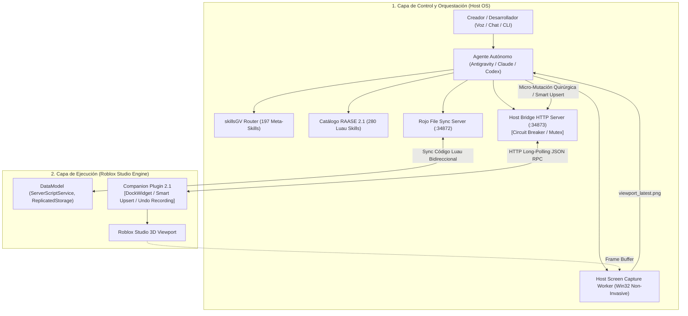

# robloxIA — Sistema Autónomo de Desarrollo para Roblox Studio (RAASE 2.1)
### *Inspirado en el sistema "Generador de Robux 3000" (DEValen) y basado en estándares de ingeniería Luau 2026*

`robloxIA` (Roblox Autonomous Agent Studio Engine — **RAASE 2.1**) es una arquitectura de desarrollo desatendido de grado de producción que convierte a cualquier agente de Inteligencia Artificial (Google Antigravity, Claude Code, OpenAI Codex, OpenCode, Cursor) en un **Ingeniero de Software y Diseñador Técnico Autónomo de Roblox Studio**.

El sistema traduce intenciones de alto nivel (vía voz, chat o terminal) en:
1. **Lógica autoritativa en Luau estricto (`--!strict`)** libre de vulnerabilidades y fugas de memoria mediante ciclo de vida con `Janitor`.
2. **Generación procedural y manipulación bidireccional del mundo 3D** en Roblox Studio (inspección, mutación quirúrgica y eliminación segura sincronizadas con `ChangeHistoryService`).
3. **Auditoría estética asistida por visión computacional con convergencia estricta de 2 pases** y cortacircuitos activo para erradicar bucles infinitos.
4. **Arquitectura transaccional de persistencia y cumplimiento DevEx 2026** (tasa preferencial U.S. 18+ de $0.0054 USD por Robux con avatares R15).

---

## 🏛️ Arquitectura del Sistema (RAASE 2.1)



---

## 🌟 Novedades y Mejoras de RAASE 2.1

### 1. Grafo de Escena Bidireccional (Introspección Total)
El puente ya no opera a ciegas. Dispone de primitivas RPC completas para consultar y modificar el árbol del juego:
* `GET_SCENE_GRAPH`: Inspecciona la jerarquía del `Workspace` o cualquier sub-modelo con filtrado por clase, profundidad máxima y volumen AABB.
* `INSPECT_OBJECT`: Extrae al instante la posición, tamaño, material, color, atributos, etiquetas de `CollectionService` y bounding box de cualquier instancia.
* `MODIFY_OBJECT`: Altera propiedades específicas *in situ* con registro atómico en `ChangeHistoryService` (soporta `Ctrl+Z`).
* `DELETE_OBJECT`: Destruye instancias específicas de forma segura.
* `CLEAR_ZONE`: Limpia volúmenes espaciales o modelos filtrados sin tocar el resto del mapa.

### 2. Spawning Atómico con Smart Upsert
* `BATCH_SPAWN` procesa hasta **250 instancias por lote** en una única transacción de red y un solo paso de historial.
* **Smart Upsert Anti-Z-Fighting**: Si una parte con el mismo nombre ya existe en el modelo destino, actualiza sus propiedades en lugar de clonar una segunda parte idéntica encima, eliminando el solapamiento de geometría y las colisiones duplicadas.
* Soporte nativo para adjuntar automáticamente `SpecialMesh`, `ProximityPrompt`, `BillboardGui` y `Sound` 3D en el mismo despacho.

### 3. Cortacircuitos de Captura de Pantalla (Anti-Bucle Infinito)
* **Guardia en el Bridge:** Limita las capturas consecutivas a un máximo de **2**. Si un agente intenta tomar una 3ª captura consecutiva sin haber ejecutado una mutación real en la escena, el servidor responde con **HTTP 429 (`CIRCUIT_BREAKER_TRIGGERED`)**, deteniendo cualquier loop infinito.
* Solo los comandos de mutación real de escena (`BATCH_SPAWN`, `MODIFY_OBJECT`, `DELETE_OBJECT`, `CLEAR_ZONE`, `SET_TERRAIN_VOXELS`, `SET_LIGHTING`, `EXECUTE_LUAU`, `SPAWN_PART`, `CREATE_ISLAND`) reinician el contador a cero.
* Endpoint de desbloqueo manual: `POST /api/capture/reset`.

### 4. Captura de Pantalla No Invasiva
* El worker de visión (`bridge/screen_capture.py`) ya no fuerza `SetForegroundWindow` ni `ShowWindow(SW_RESTORE)` incondicionalmente en cada cuadro. Solo restaura la ventana si está minimizada y no roba el foco del usuario mientras trabaja en Windows.

### 5. Panel DockWidget Nativo en Studio
* Interfaz desacoplable en Roblox Studio (`DockWidgetPluginGui`) con:
  * **Indicador LED de 4 estados**: 🟢 ONLINE (Port 34873), 🟣 BUSY (Executing Actuator), 🟡 PAUSED, 🔴 OFFLINE.
  * **Métricas en tiempo real**: Memoria RAM (MB), primitivas activas, instancias en Workspace y comandos ejecutados.
  * **Botones de acción rápida**: Pausar/Reanudar sondeo, Limpiar Props (`Clear Props`) y Test de Conexión (`Ping Bridge`).
  * **Activity Stream**: Consola de logs con marca de tiempo de cada orden recibida.

### 6. Catálogo Ampliado a 280 Habilidades
Se incorporaron 3 nuevos módulos formales bajo el estándar `agentskills.io`:
* **`roblox-11-map-making`** (Skills 236-250): Zonificación de mundos, clearance AABB, mezcla de biomas y presupuestos de streaming.
* **`roblox-12-model-maker`** (Skills 251-265): Ensamble modular, pivotes en base, rodapiés/molduras (*trims*) y directiva anti-neón.
* **`roblox-13-vfx-maker`** (Skills 266-280): Curvas térmicas de partículas, vigas (*Beams*), estelas (*Trails*) y luces con sombras dinámicas.

---

## 🛠️ Historial de Bugs Corregidos (Changelog de Estabilidad)

| Fallo / Síntoma | Causa Técnica | Solución Implementada en RAASE 2.1 |
| :--- | :--- | :--- |
| **Error en `SET_LIGHTING` (`RobloxScript capability`)** | Intentar escribir `Lighting.Technology` directamente lanzaba un error fatal de permisos de seguridad en el hilo del plugin. | Todas las propiedades de `Lighting` ahora se ejecutan dentro de bloques `pcall`, aplicando iluminación, sombras, reloj y atmósfera de forma segura. |
| **Parpadeo en falso de "🔴 OFFLINE" tras cada comando** | `updateStatusUI()` mutaba `connectionStatus = "BUSY"`. Al terminar el comando (`isBusy = false`), la UI no encontraba el estado `"ONLINE"` y caía en la rama `else` (OFFLINE) hasta el siguiente tick. | Se separó la salud de la red (`connectionStatus`) del estado de ejecución (`isBusy`). La UI muestra `🟣 BUSY` y regresa fluidamente a `🟢 ONLINE` sin parpadear en rojo. |
| **Bloque de pasto gigante no seleccionable que tapaba caminos** | El agente generó un bloque de **Terreno Voxel** (`workspace.Terrain`), el cual no se puede seleccionar con la herramienta estándar de ratón ni borrar como una pieza normal, y sus colinas tapaban los caminos a `Y = 0.15`. | Se vació el bloque voxel con material `Air` y se sustituyó por una pieza normal (`BasePart`) llamada `Plaza_Lawn_Selectable` a `Y = -0.5`. Es 100% seleccionable, editable y borrable con el ratón o la tecla Supr. |
| **Cursor del ratón trabado al mover cámara con clic derecho** | `FOCUS_CAMERA` modificaba `Camera.CFrame` pero dejaba `Camera.Focus` desfasado. Al dar clic derecho, el controlador de órbita de Studio regresaba el cursor violentamente al punto antiguo. | Se sincronizó de forma obligatoria `Camera.Focus = CFrame.new(center)` en cada reubicación de cámara, manteniendo la órbita del ratón en perfecta sincronía. |
| **Re-creación no deseada de objetos borrados por el usuario** | El agente re-ejecutaba scripts monolíticos completos que sobreescribían los cambios manuales del creador. | **Regla RN-10 (Soberanía del Creador)**: Prohibición estricta de re-crear o restaurar objetos borrados por el usuario sin orden textual directa, y uso exclusivo de micro-mutaciones quirúrgicas. |
| **Bucle infinito de capturas (30 min de fotos sin cambios)** | El prompt permitía auto-perfección abierta y el bridge no limitaba capturas consecutivas. | **Cortacircuitos en el Bridge** (bloqueo con HTTP 429 a la 3ª captura consecutiva) + **Regla RN-11 de 2 Pases** (parada obligatoria tras la verificación). |

---

## 📁 Estructura del Repositorio

```
robloxIA/
├── bridge/                         # Servidor local de enlace Host <-> Studio
│   ├── server.mjs                  # Servidor HTTP REST + Long-Polling + Cortacircuitos (:34873)
│   ├── screen_capture.py           # Capturador host-side de Viewport no invasivo
│   ├── open_cloud.mjs              # Conector de subida a Roblox Open Cloud API
│   ├── test_bridge_v2_1.mjs        # Suite de pruebas unitarias e integración del bridge
│   ├── test_circuit_breaker.mjs    # Test automatizado del cortacircuitos de capturas
│   └── package.json                # Configuración npm del bridge
├── plugin/                         # Companion Plugin para Roblox Studio
│   ├── CompanionPlugin.server.luau # Luau estricto con DockWidget UI, Smart Upsert y Grafo RPC
│   ├── default.project.json        # Configuración Rojo para compilar el plugin
│   └── RAASE_Companion.rbxm        # Binario compilado del plugin listo para desplegar
├── project_template/               # Plantilla de juego Roblox de producción
│   ├── default.project.json        # Mapeo Rojo a DataModel
│   ├── wally.toml                  # Gestor de paquetes Wally (Janitor, Signal, Promise)
│   ├── selene.toml                 # Reglas de linter Selene
│   ├── stylua.toml                 # Reglas de formateo StyLua
│   └── src/
│       ├── server/                 # Scripts autoritativos en ServerScriptService
│       │   ├── NetworkSecurityService.luau # Token Bucket + Honeypots + Rate Limiting
│       │   ├── DataPersistenceService.luau # UpdateAsync + Session Locking transaccional
│       │   ├── MonetizationService.luau    # ProcessReceipt idempotente + DevEx 2026
│       │   ├── LobbyInteractionService.luau# Interacciones ProximityPrompt de tiendas y forjas
│       │   └── init.server.luau            # Bootstrap del servidor
│       ├── client/                 # Scripts en StarterPlayerScripts
│       │   ├── CharacterController.client.luau # Cinemática procedural Motor6D.Transform
│       │   └── HUDController.client.luau       # UI reactiva escalada sin distorsión
│       └── shared/                 # Módulos en ReplicatedStorage
│           ├── Types.luau          # Tipado estricto Luau 2026
│           └── Janitor.luau        # Erradicación de fugas de memoria
├── agent/                          # Herramientas del Agente Autónomo
│   ├── system_prompt.md            # Master System Prompt con reglas RN-10 y RN-11
│   ├── raase_skills.json           # Matriz indexada de las 280 micro-habilidades técnicas
│   ├── orchestrator_cli.mjs        # CLI para canalizar comandos, inspección y visión
│   ├── fix_terrain_and_details.mjs # Utilidad de nivelación de terreno
│   └── generators/                 # Generadores procedurales de alto nivel
│       ├── build_magic_lobby.mjs   # Generador modular del Magic Lobby medieval
│       ├── attach_prompts_and_guis.mjs # Inyector de ProximityPrompts y BillboardGuis
│       ├── capture_tour.mjs        # Recorrido guiado de capturas con cámara estricta
│       └── deploy_server_scripts.mjs # Inyector directo de servicios en Studio
├── skills-roblox/                  # Especificación formal de skills (agentskills.io)
│   ├── roblox-11-map-making/       # Level Design y zonificación espacial
│   ├── roblox-12-model-maker/      # Modelado modular y directiva anti-neón
│   └── roblox-13-vfx-maker/        # Partículas, vigas, estelas e iluminación
├── docs/                           # Documentación y Especificación Técnica
│   └── RAASE_2_0_SPECIFICATION.md  # Blueprint arquitectónico formal
├── PROJECT_TRACKER.md              # Ledger de estado del proyecto (skillsGV format)
├── CLAUDE.md                       # Reglas de desarrollo para agentes CLI
└── README.md                       # Documentación principal
```

---

## 🚀 Guía de Inicio Rápido (Setup en 4 Pasos)

### 1. Iniciar el Servidor de Enlace (Bridge)
En una terminal:
```bash
node bridge/server.mjs
```
El servidor escuchará en `http://127.0.0.1:34873` con cortacircuitos de captura activado.

### 2. Instalar el Companion Plugin en Roblox Studio
* Abre **Roblox Studio**.
* Ve a `Plugins -> Plugins Folder` en Studio y copia el archivo `plugin/RAASE_Companion.rbxm` generado dentro de esa carpeta (o ejecuta el comando de despliegue automático):
  ```powershell
  Copy-Item "plugin/RAASE_Companion.rbxm" "$env:LOCALAPPDATA\Roblox\Plugins\RAASE_Companion.rbxm" -Force
  ```
* En Studio, activa los permisos HTTP en: `Game Settings -> Security -> Allow HTTP Requests` (**Activado**).
* Aparecerá la ventana desacoplable **RAASE 2.1 — Autonomous Studio Engine** con el indicador LED en verde `🟢 ONLINE (Port 34873)`.

### 3. Sincronizar el Código Luau con Rojo
En otra terminal:
```bash
rojo serve project_template/default.project.json
```
En Studio, abre el plugin de Rojo y presiona **Connect**.

### 4. Usar la CLI del Orquestador
Puedes interactuar directamente con Studio desde tu terminal o permitir que el agente lo haga:
```bash
# Consultar estado y telemetría del bridge
node agent/orchestrator_cli.mjs status

# Inspeccionar el grafo de escena en Workspace (profundidad 1)
node agent/orchestrator_cli.mjs scene-graph workspace 1

# Inspeccionar un objeto específico y todas sus propiedades
node agent/orchestrator_cli.mjs inspect "MagicLobby_Zone3_PotionShop"

# Modificar propiedades in-situ de una parte existente
node agent/orchestrator_cli.mjs modify "Plaza_Lawn_Selectable" '{"Color": [95, 150, 80], "Transparency": 0.05}'

# Borrar una instancia de forma segura
node agent/orchestrator_cli.mjs delete "ObjetoAntiguo"

# Limpiar una zona espacial AABB (Centro: 0, 10, 0 | Tamaño: 50, 20, 50)
node agent/orchestrator_cli.mjs clear-zone 0 10 0 50 20 50

# Tomar una captura del Viewport para auditoría visual
node agent/orchestrator_cli.mjs capture
```

---

## 🛡️ Estándares de Ingeniería Luau 2026

* **Strict Typing Obligatorio**: Todo script inicia con `--!strict`. Tipos nominales y estructurales explícitos con `export type ...`.
* **Seguridad Zero-Trust**: El cliente jamás declara daño o dinero. Todos los `RemoteEvent` validan tipos (`typeof()`), distancias espaciales (`.Magnitude <= 15`) y están protegidos por limitadores de tasa *Token Bucket* con señuelos *honeypots*.
* **Gestión de Memoria con Janitor**: Ningún `RBXScriptConnection` queda huérfano. Todo objeto destruido invoca `:Destroy()` formalmente.
* **Cinemática en RenderStepped**: Toda manipulación procedural en personajes altera EXCLUSIVAMENTE `Motor6D.Transform` en el hilo de render. Prohibido modificar `C0/C1` en bucles de tiempo de ejecución.
* **DevEx 2026 e Idempotencia**: `MarketplaceService.ProcessReceipt` persiste el `PurchaseId` en DataStore mediante `UpdateAsync()` antes de otorgar beneficios. Exclusividad de avatares R15 para calificar a la tasa preferencial U.S. 18+ ($0.0054 por Robux).
* **Soberanía del Creador (RN-10)**: Las modificaciones manuales del usuario en Studio son ley. Ningún agente puede re-crear partes eliminadas ni sobreescribir decisiones de diseño sin autorización expresa.

---

## 📚 Catálogo de Habilidades (280 Skills en 13 Dominios)

1. `luau-*` (001-025): Luau Language & Strict Typing
2. `net-*` (026-060): Networking & Anti-Exploit Security
3. `datastore-*` / `memorystore-*` (061-085): Persistence & DataStores
4. `3d-*` / `csg-*` / `terrain-*` (086-115): 3D World, CSGv3 & Procedural
5. `anim-*` (116-140): Rigging & Kinematics
6. `ui-*` (141-165): UI/UX & Reactive GUI
7. `audio-*` (166-185): Audio & DSP Effects
8. `memory-*` (186-210): Memory & Janitor Auditing
9. `economy-*` (211-225): Economy & DevEx 2026
10. `tools-*` (226-235): Tooling & Studio Automation
11. `roblox-11-map-making` (236-250): Level Design, Zoning & AABB Spatial Check
12. `roblox-12-model-maker` (251-265): Modular 3D Assembly, Trims & Anti-Neon
13. `roblox-13-vfx-maker` (266-280): Particle Emitters, Beams, Trails & Dynamic Lighting

Consulta la matriz completa en [agent/raase_skills.json](file:///c:/Users/Jhonder/Desktop/lol/agent/raase_skills.json).
