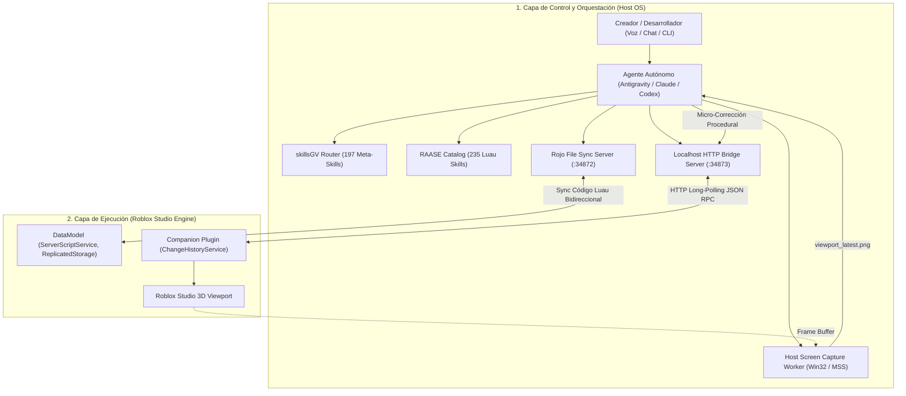

# robloxIA — Sistema Autónomo de Desarrollo para Roblox Studio (RAASE 2.0)
### *Inspirado en el sistema "Generador de Robux 3000" (DEValen) y basado en estándares de ingeniería Luau 2026*

`robloxIA` es una arquitectura de desarrollo desatendido que convierte a cualquier agente de Inteligencia Artificial (Antigravity, Claude Code, OpenAI Codex, OpenCode, Cursor) en un **Ingeniero de Software y Diseñador Técnico Autónomo de Roblox Studio**.

El sistema traduce intenciones de alto nivel (vía voz, chat o terminal) en:
1. **Lógica autoritativa en Luau estricto (`--!strict`)** libre de exploits y fugas de memoria con `Janitor`.
2. **Generación procedural de mundos 3D, iluminación y geometrías CSGv3** sincronizadas en tiempo real con el DataModel de Roblox Studio.
3. **Auditoría estética continua por visión computacional** (detección y corrección de Z-Fighting, simetría y texturas cuadrículadas).
4. **Arquitectura de persistencia transaccional y cumplimiento DevEx 2026** (tasa U.S. 18+ de $0.0054 USD por Robux).

---

## 🏛️ Arquitectura del Sistema



---

## 📁 Estructura del Repositorio

```
robloxIA/
├── bridge/                         # Servidor local de enlace Host <-> Studio
│   ├── server.mjs                  # Servidor HTTP REST + Long-Polling (Puerto 34873)
│   ├── screen_capture.py           # Capturador host-side del Viewport de Studio
│   ├── open_cloud.mjs              # Conector de subida a Roblox Open Cloud API
│   └── package.json                # Configuración npm del bridge
├── plugin/                         # Companion Plugin para Roblox Studio
│   ├── CompanionPlugin.server.luau # Código Luau con ChangeHistoryService y actuadores
│   ├── default.project.json        # Configuración Rojo para compilar el plugin
│   └── RAASE_Companion.rbxm        # Plugin binario compilado listo para usar
├── project_template/               # Plantilla de juego Roblox con Rojo
│   ├── default.project.json        # Mapeo Rojo a DataModel
│   ├── wally.toml                  # Gestor de paquetes Wally (Janitor, Signal, Promise)
│   ├── selene.toml                 # Reglas estrictas de linter Selene
│   ├── stylua.toml                 # Reglas de formato StyLua (tabulaciones, 100 cols)
│   └── src/
│       ├── server/                 # Scripts autoritativos en ServerScriptService
│       │   ├── NetworkSecurityService.luau # Token Bucket + Honeypots + Rate Limiting
│       │   ├── DataPersistenceService.luau # UpdateAsync + Session Locking transaccional
│       │   ├── MonetizationService.luau    # ProcessReceipt idempotente + DevEx 2026
│       │   └── init.server.luau            # Bootstrap del servidor
│       ├── client/                 # Scripts en StarterPlayerScripts
│       │   ├── CharacterController.client.luau # Cinemática procedural Motor6D.Transform
│       │   └── HUDController.client.luau       # UI reactiva escalada sin slop
│       └── shared/                 # Módulos en ReplicatedStorage
│           ├── Types.luau          # Tipado estricto Luau 2026
│           └── Janitor.luau        # Erradicación de fugas de memoria
├── agent/                          # Herramientas del Agente Autónomo
│   ├── system_prompt.md            # Master System Prompt para inyectar en LLMs
│   ├── raase_skills.json           # Matriz indexada de las 235 micro-habilidades técnicas
│   └── orchestrator_cli.mjs        # CLI para canalizar comandos y ciclo de visión
├── docs/                           # Documentación y Especificación Técnica
│   └── RAASE_2_0_SPECIFICATION.md  # Blueprint arquitectónico formal RAASE 2.0
├── PROJECT_TRACKER.md              # Ledger de estado del proyecto (skillsGV format)
├── CLAUDE.md                       # Reglas de desarrollo para Claude Code / Cursor
└── README.md                       # Documentación principal
```

---

## 🚀 Guía de Inicio Rápido (Setup en 4 Pasos)

### 1. Iniciar el Servidor de Enlace (Bridge)
En una terminal:
```bash
node bridge/server.mjs
```
El servidor escuchará en `http://127.0.0.1:34873`.

### 2. Instalar el Companion Plugin en Roblox Studio
- Abre **Roblox Studio**.
- Ve a `Plugins -> Plugins Folder` en Studio y copia el archivo `plugin/RAASE_Companion.rbxm` generado dentro de esa carpeta.
- En Studio, activa los permisos HTTP en: `Game Settings -> Security -> Allow HTTP Requests` (**Activado**).
- Verás el botón **RAASE 2.0 Bridge** activo en la barra de herramientas de Studio.

### 3. Sincronizar el Proyecto con Rojo
En otra terminal:
```bash
rojo serve project_template/default.project.json
```
En Studio, conecta el plugin de Rojo para sincronizar el código Luau en tiempo real.

### 4. Lanzar Comandos desde la CLI del Agente
Puedes despachar comandos directamente con la CLI o permitir que el agente de IA los ejecute:
```bash
# Inspeccionar conectividad de Studio
node agent/orchestrator_cli.mjs status

# Construir una receta procedural de 3 islas temáticas
node agent/orchestrator_cli.mjs recipe three-islands

# Tomar una captura del Viewport para auditoría de visión
node agent/orchestrator_cli.mjs capture
```

---

## 🛡️ Estándares de Ingeniería Luau 2026

- **Strict Typing Obligatorio**: Todo script inicia con `--!strict`. No se permiten tipos implícitos ni `any` descontrolados.
- **Seguridad Zero-Trust**: El cliente jamás declara daño o dinero. Todos los `RemoteEvent` validan tipos (`typeof()`), distancias espaciales (`.Magnitude <= 15`) y están protegidos por limitadores de tasa *Token Bucket*.
- **Gestión de Memoria con Janitor**: Ningún `RBXScriptConnection` queda huérfano. Las instancias desechadas se destruyen formalmente con `:Destroy()`.
- **Cinemática Sin Caídas de FPS**: Toda manipulación procedural en personajes altera EXCLUSIVAMENTE `Motor6D.Transform` en el hilo de render (`RenderStepped`). Prohibido modificar `C0/C1` en bucles.
- **Monetización DevEx 2026**: Implementación idempotente de `MarketplaceService.ProcessReceipt` registrando `PurchaseId` en DataStore antes de otorgar beneficios. Avatares exclusivamente en R15 para calificar a la tasa preferencial U.S. 18+ ($0.0054/R).

---

## 📚 Catálogo Taxonómico de Skills (235 Habilidades)

El sistema cuenta con un catálogo completo de 235 micro-habilidades organizadas en 10 dominios:
1. `luau-*` (001-025): Luau Language & Strict Typing
2. `net-*` (026-060): Networking & Anti-Exploit Security
3. `datastore-*` / `memorystore-*` (061-085): Persistence & DataStores
4. `3d-*` / `csg-*` / `terrain-*` (086-115): 3D World, CSGv3 & Procedural
5. `anim-*` (116-140): Rigging & Kinematics
6. `ui-*` (141-165): UI/UX & Reactive GUI
7. `audio-*` (166-185): Audio & DSP Effects
8. `memory-*` (186-210): Memory & Janitor Auditing
9. `economy-*` (211-225): Economy & DevEx 2026
10. `tools-*` (226-235): Tooling & Studio Automation

Consulta la matriz completa en [agent/raase_skills.json](file:///agent/raase_skills.json).
