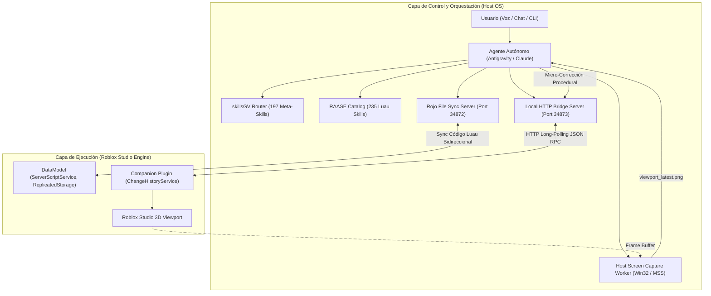

# SISTEMA AUTÓNOMO DE DESARROLLO Y ORQUESTACIÓN PARA ROBLOX STUDIO
## ROBLOX AUTONOMOUS AGENT STUDIO ENGINE (RAASE 2.0)
### ESPECIFICACIÓN TÉCNICA FORMAL, INGENIERÍA EN LUAU Y PROTOCOLO DE CONEXIÓN

---

**Clasificación:** Especificación Formal de Arquitectura de Software e IA Autónoma  
**Dominio:** Automatización de Roblox Studio, Luau 2026, Visión Computacional y Redes Autoritativas  
**Versión del Sistema:** 2.0.0 (Producción 2026)  
**Estado:** Documento Maestro Aprobado  

---

## 1. INTRODUCCIÓN Y JUSTIFICACIÓN
El sistema **RAASE 2.0 (robloxIA)** es un entorno de desarrollo asistido y autónomo diseñado para superar las limitaciones de los flujos de trabajo tradicionales en Roblox Studio. Permite que un agente de Inteligencia Artificial (Antigravity, Claude Code, OpenAI Codex, OpenCode) tome el control coordinado del motor de desarrollo sin requerir intervención manual constante.

Inspirado en la filosofía del *"Generador de Robux 3000"* (DEValen) y refinado con estándares de ingeniería de software para Luau 2026, RAASE 2.0 resuelve los 5 problemas endémicos del desarrollo de Roblox:
1. **Fricción de Maquetación Manual:** Automatización de la generación de terreno, islas flotantes y decoraciones mediante comandos de alto nivel.
2. **Vulnerabilidades Críticas de Red:** Aplicación mandatoria del modelo de seguridad Zero-Trust en el servidor con Token Bucket y remotos señuelo.
3. **Fugas de Memoria en Luau:** Erradicación de conexiones de eventos huérfanas mediante el ciclo de vida estricto con `Janitor`.
4. **Defectos Estéticos en Viewport:** Detección y corrección procedural de Z-fighting, rotaciones imperfectas y desfases de texturas checkerboard mediante visión artificial.
5. **Monetización y DevEx 2026:** Arquitectura de compras idempotente y soporte exclusivo de avatares R15 para calificar a la tasa preferencial U.S. 18+ ($0.0054 USD por Robux).

---

## 2. ARQUITECTURA GENERAL DEL SISTEMA



### Canales de Comunicación Desacoplados:
1. **Canal de Código y Estructura (Rojo):** Sincroniza en tiempo real archivos de texto (`.luau`, `.json`) del sistema de archivos local con el árbol de instancias de Roblox Studio.
2. **Canal de Edición de Escena (Companion Plugin RPC):** Servidor HTTP local en el puerto `34873`. El plugin de Studio ejecuta polling periódico (`GET /api/poll`) para recibir comandos que manipulan la cámara, instancian geometrías, ejecutan operaciones booleanas de `GeometryService` y registran waypoints con `ChangeHistoryService`.
3. **Canal de Auditoría Visual (Vision Loop):** Un worker host-side toma capturas de la ventana de Roblox Studio, recorta el Viewport 3D y genera `viewport_latest.png` para que el modelo multimodal inspeccione texturas y geometría.
4. **Canal de Ingesta de Assets (Roblox Open Cloud):** Permite subir archivos 3D (`.glb`), audios y texturas directamente al inventario de la experiencia, obteniendo de inmediato el identificador canónico `rbxassetid://`.

---

## 3. ESPECIFICACIÓN DE COMPONENTES

### 3.1. Servidor de Enlace Local (Local HTTP Bridge)
- **Tecnología:** Node.js nativo (ESM) sin dependencias nativas complejas.
- **Puerto:** `34873`.
- **Endpoints:**
  - `GET /api/poll`: Retorna el siguiente comando en la cola de tareas para Studio (soporta long-polling con timeout de 5 segundos).
  - `POST /api/report`: Permite a Studio reportar el resultado de la ejecución (éxito, error, IDs generados, telemetría).
  - `POST /api/command`: Endpoint donde el agente CLI encola una acción para Studio.
  - `POST /api/capture`: Dispara la captura del Viewport por el script de visión.
  - `GET /api/status`: Proporciona telemetría de Studio (memoria, FPS, instancias).

### 3.2. Companion Plugin de Roblox Studio
- **Seguridad:** Corre en contexto `Plugin` con permisos HTTP activados.
- **Gestión de Historial:** Toda acción ejecutada está protegida por:
  ```lua
  local recording = ChangeHistoryService:TryBeginRecording("RAASE_" .. payload.action)
  -- Ejecución del comando
  ChangeHistoryService:FinishRecording(recording, Enum.FinishRecordingOperation.Commit)
  ```
- **Capacidades:**
  - `SPAWN_PART`: Genera partes con CFrame, tamaño, color y propiedades físicas.
  - `CREATE_ISLAND`: Genera islas flotantes modulares basadas en ruido Perlin y paletas de bioma.
  - `CSG_OPERATION`: Realiza `UnionAsync`, `SubtractAsync` e `IntersectAsync`.
  - `SET_TERRAIN_VOXELS`: Modificaciones directas en `Terrain:WriteVoxels()`.
  - `SET_LIGHTING`: Aplica presets atmosféricos y de iluminación Future.
  - `FOCUS_CAMERA`: Posiciona la cámara en el Viewport para enfocar el objeto a auditar.

### 3.3. Worker de Captura de Viewport
- **Tecnología:** Python con Win32 API / MSS o PowerShell automatizado.
- **Funcionamiento:**
  1. Identifica la ventana de Roblox Studio por clase y título.
  2. Obtiene las coordenadas del cliente y descuenta los paneles de UI (Explorer, Properties, Ribbon Bar).
  3. Guarda la imagen en `viewport_latest.png`.

---

## 4. ESTÁNDARES DE INGENIERÍA EN LUAU 2026

1. **Tipado Estricto Obligatorio:** Todo script comienza con `--!strict`. Se prohíbe el uso indiscriminado de `any`.
2. **Acceso Canónico a Servicios:** Exclusivamente `game:GetService("NombreServicio")`.
3. **Manejo Explícito de Nulidad:** Se debe evaluar `valor == nil`.
4. **Desconexión con Janitor:** Ninguna conexión a eventos (`RBXScriptConnection`) debe quedar sin limpiar al destruirse el objeto o morir el jugador.
5. **Manipulación de Articulaciones:** Manipular exclusivamente `Motor6D.Transform` en el hilo de render. Prohibido mutar `C0/C1` en bucles de tiempo de ejecución.
6. **Seguridad Zero-Trust:** El servidor jamás confía en precios, daño o distancias enviadas por el cliente. Validación estricta con `typeof()` y limitación de tasa por Token Bucket.
7. **Persistencia Transaccional:** `DataStore:UpdateAsync()` con Session Locking (bloqueo por timestamp en metadata) y guardado seguro en `game:BindToClose()`.
8. **DevEx 2026:** Registro transaccional de `PurchaseId` en `MarketplaceService.ProcessReceipt` y uso exclusivo de personajes R15.

---

## 5. CATÁLOGO DE SKILLS DE INGENIERÍA (235 HABILIDADES)

El sistema agrupa sus capacidades técnicas en 10 dominios cardinales:
1. **Luau Language & Strict Typing** (Skills 001 - 025): Tipado estricto, genéricos, buffer binario, lambdas inmutables, `task` library.
2. **Networking & Anti-Exploit Security** (Skills 026 - 060): Token bucket, honeypots, validación espacial, unreliability remotes, lag compensation.
3. **Persistence & DataStores** (Skills 061 - 085): Session locking, UpdateAsync, migraciones de esquema, MemoryStore, rotación de backups.
4. **3D World, CSGv3 & Procedural** (Skills 086 - 115): Ruido Perlin, islas flotantes, WriteVoxels, GeometryService, PBR, dispersión de props.
5. **Rigging & Kinematics** (Skills 116 - 140): Motor6D.Transform, IKControl, resortes de vaivén de arma, ragdoll transitions.
6. **UI/UX & Reactive GUI** (Skills 141 - 165): Componentes reactivos, UIAspectRatioConstraint, CanvasGroup, layouts adaptativos.
7. **Audio & DSP Effects** (Skills 166 - 185): SoundGroups, zonas acústicas, AudioEqualizer, ducking sidechain, audio wiring graph.
8. **Memory & Janitor Auditing** (Skills 186 - 210): Patrón Janitor, PartCache pooling, Physics sleep, Spatial hashing, draw calls batching.
9. **Economy & DevEx 2026** (Skills 211 - 225): ProcessReceipt idempotente, tasa preferencial U.S. 18+, probabilidades transparentes de drops.
10. **Tooling & Studio Automation** (Skills 226 - 235): Sincronización con Rojo, plugin RPC, captura de viewport, análisis visual de simetría y texturas.
