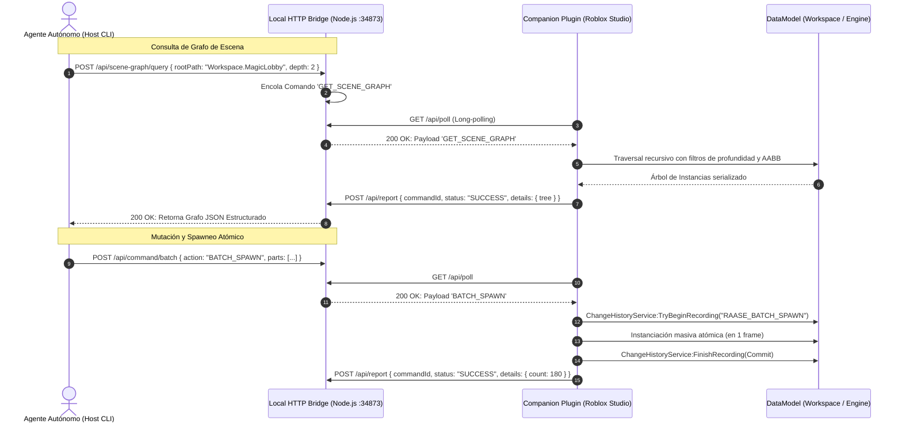
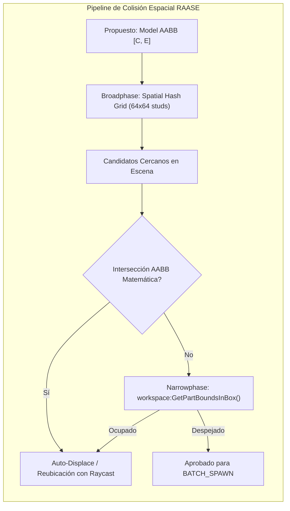
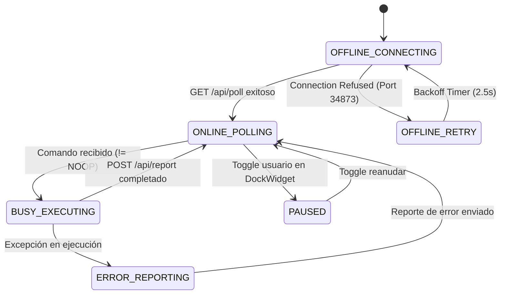

# ESPECIFICACIÓN DE ARQUITECTURA Y DISEÑO DE SISTEMAS (SDD)
## ROBLOX AUTONOMOUS AGENT STUDIO ENGINE (RAASE 2.1)
### ESPECIFICACIÓN TÉCNICA FORMAL: GRAFO DE ESCENA BIDIRECCIONAL, COLISIÓN ESPACIAL AABB, CATÁLOGO DE SKILLS Y DOCKWIDGET DE STUDIO

---

**Clasificación:** Software Design Description (SDD) / Architectural Specification  
**Dominio:** Automatización de Roblox Studio, Luau 2026, Visión Multimodal y Redes RPC  
**Versión del Sistema:** 2.1.0  
**Autor:** SDD Architect & Systems Planner (`skillsGV: professional-planner & architecture-designer`)  
**Fecha:** 2026-09-07  
**Estado:** Documento Maestro Aprobado  

---

## 1. FASE 1: DEFINICIÓN DE PROBLEMAS, ANÁLISIS DE CAUSA RAÍZ Y REQUERIMIENTOS

### 1.1. Auditoría de Defectos del Mundo Real en RAASE 2.0
Las pruebas operacionales en Roblox Studio revelaron cinco fallas arquitectónicas críticas:

1. **Ceguera del Grafo de Escena (Scene Graph Blindness) y Solapamiento de Modelos:**
   - *Falla:* El agente operaba en modo exclusivamente unidireccional (*fire-and-forget*). Carecía de primitivas para introspeccionar el árbol de instancias en `Workspace`.
   - *Consecuencia:* Al solicitar refinamientos sobre una estructura previa (ej. *"modifica la fuente"* o *"añade murallas"*), el agente generaba un nuevo set de partes en las mismas coordenadas espaciales, produciendo *Z-fighting* severo, duplicación masiva de colisiones físicas y destrucción del rendimiento de renderizado.
   - *Incapacidad Operativa:* Imposibilidad de inspeccionar propiedades existentes (`CFrame`, `Size`, `Material`, `Color`), mutar instancias in situ o eliminar de forma segura geometría obsoleta.

2. **Degradación Estética, Invasión de Material Neón y Ausencia de VFX Modernos:**
   - *Falla:* Uso indiscriminado y descalibrado del material `Neon` (ej. agua de neón cegador, dianas de tiro de neón, losetas de piso de neón).
   - *Consecuencia:* Ruptura visual del estilo artístico (violación de paletas heráldicas/medievales), saturación del búfer de *Bloom* en el motor de renderizado y aspecto de "juego de principiante".
   - *Carencias:* Ausencia de chaflanes/molduras (*bevels* y *trims*) para romper bordes rectos artificiales de 90°, falta de sistemas de partículas modernos (`ParticleEmitter` con curvas `NumberSequence`), ausencia de `Beams`, `Trails`, `Highlights` y luces dinámicas con sombras calculadas (`PointLight.Shadows = true`).

3. **Ambigüedad en la UX del Plugin de Roblox Studio:**
   - *Falla:* El plugin companion solo presentaba un botón estático en la barra de herramientas (`plugin:CreateToolbar`) con el texto `"RAASE_Toggle"`.
   - *Consecuencia:* El desarrollador humano no disponía de retroalimentación visual sobre el estado del enlace: si el puente local Node.js estaba activo o desconectado, si el bucle de long-polling estaba pausado o si el motor estaba procesando un comando masivo.

4. **Vacío Estructural en el Catálogo de Habilidades (Skills):**
   - *Falla:* Las 235 micro-habilidades originales cubrían Luau estricto, redes, datastores y microprofiler, pero carecían de tres dominios esenciales de creación de experiencias:
     - *Level Design & Map Making:* Zonificación, biomas a gran escala, márgenes de seguridad y streaming.
     - *Model Making:* Ensamblado micro-modular, proporciones canónicas, jerarquías de modelos y asignación de `PrimaryPart`.
     - *VFX Creation:* Sistemas de emisión de partículas, curvas de color y transparencia, y renderizado volumétrico de luces.

5. **Falla de Esquema JSON, Búferes y Throttling HTTP de Roblox Studio:**
   - *Falla:* Al construir estructuras complejas (ej. `agent/build_magic_lobby.mjs`), el agente emitía más de 450 peticiones HTTP individuales consecutivas (`POST /api/command`) con un solo objeto a la vez.
   - *Causa Raíz:* `HttpService` en Roblox Studio tiene un límite estricto de **500 peticiones por minuto por lugar**. La ráfaga de 450 spawns + 450 reportes saturó el búfer en menos de 60 segundos, provocando respuestas HTTP 429 ("Too Many Requests") con páginas de error de texto plano. Al intentar decodificar estas respuestas con `HttpService:JSONDecode()`, Luau colapsó con `Can't parse JSON`.
   - *Incompatibilidad de Tipos Luau:* El intento de serializar tipos nativos del motor (`Vector3`, `CFrame`, `Color3`, `Instance`) mediante `JSONEncode` arroja `Cannot convert to a JSON string`.
   - *Escape de Scripts:* Scripts multilinea Luau con comillas o retornos de carro sin sanitizar rompieron el parser en Node.js y Luau.

```mermaid
flowchart TD
    subgraph BottleneckAnalysis ["Análisis del Cuello de Botella en RAASE 2.0"]
        A["Agent CLI (450 partes)"] -->|450 HTTP POST individuales| B["Bridge (Port 34873)"]
        B -->|Long-Polling 1 a 1| C["Studio Plugin"]
        C -->|450 HTTP POST /api/report| B
        C -->|Total: 900 Req / Min| D{"HttpService Quota (500 req/min)"}
        D -->|Superado| E["HTTP 429 Throttle / HTML Error"]
        E -->|JSONDecode() crash| F["Falla Crítica de Construcción"]
    end
```

---

### 1.2. Requerimientos Funcionales y No Funcionales

#### Requerimientos Funcionales (FR)
- **FR-01 (Introspección de Grafo de Escena):** Endpoint RPC `GET_SCENE_GRAPH` capaz de retornar el árbol jerárquico de `Workspace` o sub-modelos con filtros de profundidad (`depth`), clase (`classFilter`), etiquetas (`tagFilter`) y volumen espacial AABB (`boundingZone`).
- **FR-02 (Inspección Profunda de Instancia):** Endpoint RPC `INSPECT_OBJECT` que devuelve propiedades exhaustivas (`CFrame`, `Size`, `Material`, `Color`, `Transparency`, `Anchored`, `CanCollide`), atributos (`GetAttributes()`), etiquetas de `CollectionService` e inventario de hijos.
- **FR-03 (Mutación Segura en Vivo):** Endpoint RPC `MODIFY_OBJECT` para alterar propiedades de instancias existentes sin requerir su destrucción y recreación.
- **FR-04 (Eliminación Segura con Historial):** Endpoint RPC `DELETE_OBJECT` que elimina instancias específicas registrando el cambio en `ChangeHistoryService`.
- **FR-05 (Purga Espacial de Zona):** Endpoint RPC `CLEAR_ZONE` que limpia geométricamente un volumen AABB o una carpeta de modelo objetivo antes de iniciar reconstrucciones.
- **FR-06 (Spawneo Atómico por Lotes):** Endpoint RPC `BATCH_SPAWN` que recibe un arreglo de hasta 250 definiciones de partes/modelos en **una única transacción HTTP**, reduciendo el tráfico en un 99.6%.
- **FR-07 (Detección de Colisiones AABB):** Motor de cálculo espacial que valida la no-intersección de cajas delimitadoras antes del instanciado o reubica inteligentemente props.
- **FR-08 (Matriz Estética y Regla Anti-Neón):** Prohibición terminante de `Neon` para superficies masivas y fluidos; sustitución obligatoria por `Terrain:FillBlock` (Agua) o `Glass` con reflexión calibrada.
- **FR-09 (DockWidget Interactivo):** Panel `DockWidgetPluginGui` acoplable con indicadores visuales de estado (Online, Busy, Paused, Offline), telemetría en tiempo real y registro de comandos.
- **FR-10 (Catálogo de Skills 2.1):** Incorporación formal de los 35 dominios técnicos completos con 610 micro-habilidades (Skills 001 a 610) bajo el estándar `agentskills.io`.

#### Requerimientos No Funcionales (NFR)
- **NFR-01 (Presupuesto de Red Luau):** El consumo de red del plugin DEBE mantenerse siempre por debajo de 120 peticiones por minuto (< 25% del límite del motor).
- **NFR-02 (Integridad de Deshacer/Rehacer):** Toda operación unitaria o por lotes DEBE estar encapsulada en una grabación de `ChangeHistoryService` para permitir reversión instantánea con `Ctrl+Z`.
- **NFR-03 (Tolerancia a Fallos de Serialización):** La capa de serialización Luau-JSON jamás debe lanzar excepciones fatales ante tipos nativos; debe transformar automáticamente `Vector3`, `CFrame`, `Color3` y `EnumItem` a representaciones canónicas primitivas.
- **NFR-04 (Rendimiento de Introspección):** La consulta de grafo de escena no debe bloquear el hilo principal de Studio por más de 16 milisegundos (1 frame).

---

## 2. FASE 2: PROTOCOLO RPC BIDIRECCIONAL Y ESPECIFICACIÓN DE INTERFAZ

### 2.1. Arquitectura del Protocolo Bidireccional
El protocolo desacopla la intención del agente autónomo de la ejecución en el motor mediante un modelo de mensajería asíncrona sobre HTTP Long-Polling y WebHooks de retorno:



---

### 2.2. Definiciones de Cargas Útiles (RPC Payloads) y Esquemas JSON

#### 1. RPC: `GET_SCENE_GRAPH`
Permite al agente explorar la jerarquía espacial antes de realizar cualquier intervención.

**Carga de Solicitud (Host -> Bridge -> Plugin):**
```json
{
  "id": "cmd_sg_1741390001",
  "action": "GET_SCENE_GRAPH",
  "args": {
    "rootPath": "Workspace",
    "maxDepth": 3,
    "classFilter": ["Model", "Folder", "BasePart", "SpawnLocation"],
    "tagFilter": ["BuildingZone", "Decor"],
    "boundingZone": {
      "center": [0, 5, 0],
      "size": [160, 40, 160]
    },
    "includeProperties": true,
    "limit": 300
  }
}
```

**Carga de Respuesta (Plugin -> Bridge -> Host):**
```json
{
  "commandId": "cmd_sg_1741390001",
  "status": "SUCCESS",
  "details": {
    "totalScanned": 124,
    "returnedCount": 42,
    "root": {
      "name": "Workspace",
      "className": "Workspace",
      "path": "Workspace",
      "children": [
        {
          "name": "MagicLobby",
          "className": "Model",
          "path": "Workspace.MagicLobby",
          "instanceId": "rbx-inst-8942-10",
          "primaryPart": "CourtyardFloor",
          "cframe": [0, 5, 0, 1, 0, 0, 0, 1, 0, 0, 0, 1],
          "size": [156, 32, 156],
          "childCount": 118,
          "tags": ["LobbyRoot"],
          "children": [
            {
              "name": "Fountain_OuterBasin",
              "className": "Part",
              "path": "Workspace.MagicLobby.Fountain_OuterBasin",
              "instanceId": "rbx-inst-8942-11",
              "material": "Cobblestone",
              "color": [92, 98, 112],
              "transparency": 0,
              "size": [16, 2.2, 16],
              "position": [0, 6.1, 0],
              "anchored": true,
              "canCollide": true,
              "childCount": 0
            }
          ]
        }
      ]
    }
  },
  "telemetry": { "memoryMb": 412.5, "primitives": 1890, "instances": 3420 }
}
```

---

#### 2. RPC: `INSPECT_OBJECT`
Proporciona metadatos detallados de un objeto seleccionado o identificado por su ruta.

**Carga de Solicitud:**
```json
{
  "id": "cmd_inspect_1741390002",
  "action": "INSPECT_OBJECT",
  "args": {
    "targetPath": "Workspace.MagicLobby.Fountain_Water",
    "instanceId": null
  }
}
```

**Carga de Respuesta:**
```json
{
  "commandId": "cmd_inspect_1741390002",
  "status": "SUCCESS",
  "details": {
    "found": true,
    "name": "Fountain_Water",
    "className": "Part",
    "path": "Workspace.MagicLobby.Fountain_Water",
    "properties": {
      "CFrame": [0, 7.0, 0, 1, 0, 0, 0, 1, 0, 0, 0, 1],
      "Position": [0, 7.0, 0],
      "Orientation": [0, 0, 0],
      "Size": [14.8, 0.3, 14.8],
      "Color": [95, 190, 225],
      "Material": "Glass",
      "Transparency": 0.4,
      "Reflectance": 0.25,
      "Anchored": true,
      "CanCollide": false,
      "CastShadow": false,
      "Mass": 12.4
    },
    "attributes": { "InteractiveWater": true, "DepthStuds": 1.8 },
    "tags": ["WaterVolume", "AudioReverbZone"],
    "children": [
      { "name": "WaterSplashParticles", "className": "ParticleEmitter" },
      { "name": "FountainSound", "className": "Sound" }
    ]
  }
}
```

---

#### 3. RPC: `MODIFY_OBJECT`
Aplica cambios atómicos a propiedades de instancias existentes en `Workspace`.

**Carga de Solicitud:**
```json
{
  "id": "cmd_mod_1741390003",
  "action": "MODIFY_OBJECT",
  "args": {
    "targetPath": "Workspace.MagicLobby.Fountain_Water",
    "properties": {
      "Material": "Glass",
      "Color": [60, 140, 190],
      "Transparency": 0.35,
      "Reflectance": 0.3
    },
    "attributes": {
      "LastModifiedBy": "RAASE_Agent",
      "Version": 2
    },
    "addTags": ["AuditedV2"],
    "removeTags": ["NeedsReview"]
  }
}
```

---

#### 4. RPC: `DELETE_OBJECT`
Elimina de forma segura y controlada una o varias instancias huérfanas o duplicadas.

**Carga de Solicitud:**
```json
{
  "id": "cmd_del_1741390004",
  "action": "DELETE_OBJECT",
  "args": {
    "targetPath": "Workspace.OldDuplicatedLobby",
    "recursive": true
  }
}
```

---

#### 5. RPC: `CLEAR_ZONE`
Limpia una región 3D completa basada en caja delimitadora AABB o una carpeta de contenedor, respetando instancias protegidas (como `Terrain` o `SpawnLocation`).

**Carga de Solicitud:**
```json
{
  "id": "cmd_clear_1741390005",
  "action": "CLEAR_ZONE",
  "args": {
    "zoneAABB": {
      "center": [0, 15, 0],
      "size": [180, 60, 180]
    },
    "filterModel": "Workspace.MagicLobby",
    "preserveClasses": ["Terrain", "SpawnLocation", "Camera"],
    "preserveTags": ["DoNotDestroy"],
    "dryRun": false
  }
}
```

**Carga de Respuesta:**
```json
{
  "commandId": "cmd_clear_1741390005",
  "status": "SUCCESS",
  "details": {
    "destroyedCount": 87,
    "preservedCount": 4,
    "dryRun": false
  }
}
```

---

#### 6. RPC: `BATCH_SPAWN` (Solución Fundamental al Throttling HTTP)
Envía un conjunto masivo de partes, modelos y efectos en **una única transacción**, resolviendo la saturación de 500 req/min.

**Carga de Solicitud:**
```json
{
  "id": "cmd_batch_1741390006",
  "action": "BATCH_SPAWN",
  "args": {
    "parent": "Workspace.MagicLobby",
    "createModelIfMissing": true,
    "instances": [
      {
        "name": "Wall_North_01",
        "className": "Part",
        "size": [40, 18, 3],
        "position": [0, 9, -78],
        "material": "Cobblestone",
        "color": [92, 98, 112],
        "anchored": true,
        "canCollide": true
      },
      {
        "name": "Wall_North_01_Baseboard",
        "className": "Part",
        "size": [41, 1.5, 3.8],
        "position": [0, 0.75, -78],
        "material": "Slate",
        "color": [130, 136, 150],
        "anchored": true,
        "canCollide": true
      },
      {
        "name": "Torch_North_01_Light",
        "className": "PointLight",
        "parentTarget": "Wall_North_01",
        "properties": {
          "Color": [255, 175, 85],
          "Range": 28,
          "Brightness": 2.2,
          "Shadows": true
        }
      }
    ]
  }
}
```

---

### 2.3. Capa de Serialización Segura (Luau <-> JSON)
Para evitar el colapso del parser nativo de Luau ante tipos especiales, se implementa la siguiente función matemática de mapeo bidireccional:

$$\mathcal{T}_{\text{Luau} \to \text{JSON}}(v) = \begin{cases} 
[v.X, v.Y, v.Z] & \text{si } v \in \text{Vector3} \\
[v.R \cdot 255, v.G \cdot 255, v.B \cdot 255] & \text{si } v \in \text{Color3} \\
[c_1, c_2, \dots, c_{12}] & \text{si } v \in \text{CFrame} \\
v.Name & \text{si } v \in \text{EnumItem} \\
v & \text{si } v \in \{\text{string}, \text{number}, \text{boolean}\} \\
\text{null} & \text{si } v \in \text{Instance (previene referencias cíclicas)}
\end{cases}$$

---

## 3. FASE 3: MOTOR DE COLISIÓN ESPACIAL AABB, MATRIZ ESTÉTICA Y NUEVAS SKILLS

### 3.1. Detección de Colisión Espacial y AABB Clearance en Map Making
El motor de colocación de mapas previene el solapamiento destructivo mediante la evaluación de cajas envolventes alineadas a los ejes (AABB) antes de solicitar la instanciación de cualquier prop arquitectónico.

#### Formulación Matemática de Intersección AABB 3D
Sean dos volúmenes rectangulares tridimensionales $A$ y $B$, definidos por sus centros $\mathbf{C}_A, \mathbf{C}_B \in \mathbb{R}^3$, sus semidimensiones $\mathbf{E}_A, \mathbf{E}_B \in \mathbb{R}^3$ ($\mathbf{E} = \frac{\mathbf{Size}}{2}$), y un margen de separación $\delta \ge 0$:

$$\text{Colisionan}(A, B) \iff \prod_{i \in \{x, y, z\}} \mathbb{I}\left( |C_{A, i} - C_{B, i}| < (E_{A, i} + E_{B, i} + \delta) \right) = 1$$

Donde $\mathbb{I}(\cdot)$ es la función indicadora. Si la condición se cumple simultáneamente en los tres ejes cartesianos, existe solapamiento físico no permitido.



#### Algoritmo de Auto-Displace (Reubicación Procedural):
1. Si un modelo decorativo (ej. árbol, roca, farola) colisiona con una estructura primaria (ej. muro o camino), el sistema proyecta un radio circular de búsqueda con incremento angular $\theta = \frac{2\pi}{8}$.
2. Para cada candidato $\mathbf{P}' = \mathbf{P} + r \begin{pmatrix} \cos\theta \\ 0 \\ \sin\theta \end{pmatrix}$, ejecuta un `workspace:Raycast` hacia abajo para detectar la cota del suelo y verificar despeje AABB.
3. Se acepta la primera posición con factor de solapamiento nulo y se reporta en la telemetría del comando.

---

### 3.2. Matriz Estética y Regla Anti-Neón Obligatoria

> [!CAUTION]
> **DIRECTIVA ANTI-NEÓN CATEGÓRICA (REGULACIÓN ESTÉTICA 2026):**
> Queda terminantemente PROHIBIDO el uso del material `Enum.Material.Neon` para representar fluidos (agua, pantanos), superficies estructurales masivas (losas, paredes, techos), y elementos decorativos estáticos estándar (dianas, cristales de ventana, marcos).
> 
> El material `Neon` queda reservado EXCLUSIVAMENTE para:
> 1. Filamentos incandescentes de lámparas y velas (< 0.8 studs de dimensión).
> 2. Núcleos de pociones y orbes arcanos mágicos confinados.
> 3. Pavesas y núcleos internos de hogueras/forjas (cubiertos siempre por lecho de carbón `Basalt` o `Slate`).
> Todo elemento `Neon` DEBE estar acompañado de una fuente de luz física (`PointLight` o `SurfaceLight`) con `Shadows = true` para proyectar iluminación real y evitar aspecto de "cartón brillante plano".

#### Matriz de Correspondencia de Materiales Canónicos:
| Elemento del Mundo | Material Prohibido | Material Requerido | Configuración Adicional |
| :--- | :--- | :--- | :--- |
| **Agua de Fuentes / Ríos** | `Neon` | `Glass` o `Terrain:FillBlock(Water)` | `Transparency = 0.35`, `Color3 = [60, 140, 190]`, `Reflectance = 0.25` |
| **Suelos y Plazas** | `SmoothPlastic` / `Neon` | `Cobblestone` / `Slate` | Tonos piedra neutros, juntas con losetas secundarias |
| **Bordes y Molduras** | Canto vivo plano | `TrimStone` / `WoodPlanks` | Resalte exterior de +0.3 studs para atrapar sombras `Future` |
| **Fuego de Antorchas** | Bloque cúbico de Neón | `Basalt` + `Fire` + `ParticleEmitter` | Punta carbonizada negra `[24, 24, 26]` donde nace el fuego |
| **Mobiliario y Mostradores** | `Plastic` uniforme | `Wood` / `WoodPlanks` / `Metal` | Veteado orientado paralelamente al eje mayor |
| **Vórtices y Portales** | Pared plana de Neón | `Glass` translúcido + `ParticleEmitter` | `Transparency = 0.6`, textura espiral en rotación continua |

---

### 3.3. Nuevas Habilidades del Dominio: Especificaciones `agentskills.io`

Se integran tres nuevos archivos maestros bajo el estándar formal de la industria (`agentskills.io`):

#### 1. `roblox-11-map-making` (Skills 236 - 250)
- **Ruta:** `skills-roblox/roblox-11-map-making/SKILL.md`
- **Dominio:** Level Design, Macro-Zonificación, Biomas, Clearance AABB y Optimización de Streaming.
- **Rango:** 236 a 250.
- **Habilidades Clave:**
  - `236. map-zoning-macro-layout`: Zonificación perimetral, ratios de densidad y líneas visuales hacia puntos de referencia (*landmarks*).
  - `237. map-spatial-aabb-clearance`: Validación estricta de no-solapamiento de volúmenes de construcción antes del instanciado.
  - `238. map-terrain-voxel-biome-blending`: Transición suave entre voxels de Terreno (Hierba -> Roca -> Arena) mediante interpolación de densidades.
  - `239. map-streaming-budget-allocation`: Configuración de `StreamingEnabled` con `TargetRadius = 128` y `MinRadius = 64` studs.
  - `240. map-occlusion-culling-portals`: Distribución de murallas y props masivos para optimizar el descarte de geometrías ocultas.
  - `241. map-player-circulation-chokepoints`: Diseño de avenidas de circulación mínima de 12 studs de ancho para evitar congestión de avatares.
  - `242. map-foliage-raycast-scatter`: Poblado vegetal con raycasts hacia la normal del terreno para alinear roll y pitch de los modelos.
  - `243. map-verticality-ladder-stair-ratios`: Escaleras con relación contrahuella/huella canónica (0.8 studs de alto por 1.4 studs de paso).
  - `244. map-water-volume-terrain-integration`: Integración de cuencas de agua con `Terrain:FillBlock` y lecho de piedras de río.
  - `245. map-acoustic-reverb-zones`: Asociación de `SoundGroup` y filtros de eco según volumen AABB de recintos cerrados.
  - `246. map-safe-spawn-distribution`: Colocación de múltiples `SpawnLocation` distribuidas con verificación de altura sobre el suelo.
  - `247. map-boundary-soft-kill-barriers`: Barreras invisibles perimetrales suaves antes de abismos con advertencia visual al jugador.
  - `248. map-landmark-sightline-verification`: Trazado de rayos desde el spawn a 45° para garantizar visibilidad de la meta principal.
  - `249. map-lod-distance-mesh-swapping`: Reemplazo de mallas detalladas por modelos simplificados a más de 150 studs.
  - `250. map-memory-draw-call-budget-audit`: Auditoría de presupuesto para mantener draw calls por debajo de 1.200 en móviles.

---

#### 2. `roblox-12-model-maker` (Skills 251 - 265)
- **Ruta:** `skills-roblox/roblox-12-model-maker/SKILL.md`
- **Dominio:** Micro-Ensamblado, Modelado Modular, Proporciones, Molduras y Jerarquía de Instancias.
- **Rango:** 251 a 265.
- **Habilidades Clave:**
  - `251. model-primarypart-bounding-pivot`: Asignación obligatoria de `Model.PrimaryPart` alineado en la base del objeto para facilitar `PivotTo`.
  - `252. model-anchored-root-compliance`: Todas las partes estructurales de modelos arquitectónicos DEBEN crearse como `Anchored = true`.
  - `253. model-bevel-trim-molding-profile`: Prohibición de paredes planas; adición mandatoria de rodapiés (*baseboard*) y cornisas (*cornice*).
  - `254. model-anti-neon-material-matrix`: Aplicación estricta de la directiva anti-neón; uso de `Glass`, `Cobblestone` y `WoodPlanks`.
  - `255. model-architectural-proportions-golden`: Proporciones humanas respetando avatar R15 (5 studs de alto, puertas de 8x4 studs mínimo).
  - `256. model-grain-orientation-alignment`: Alineación del veteado de madera en `CFrame.Angles` coincidiendo con la dirección de soporte.
  - `257. model-modular-wall-window-snap-grid`: Diseño de módulos de pared en rejilla estricta de 4x4 studs para encaje perfecto.
  - `258. model-hierarchical-grouping-hygiene`: Organización limpia (`Model` -> `Geometry`, `Decor`, `Lights`, `VFX`) sin partes sueltas.
  - `259. model-massless-decor-welding`: Props decorativos en accesorios deben tener `Massless = true` para no desbalancear física.
  - `260. model-surface-appearance-pbr-binding`: Inyección de `SurfaceAppearance` con mapas de relieve y rugosidad en mallas compatibles.
  - `261. model-collision-fidelity-hull-box`: Configuración de `CollisionFidelity.Box` en props pequeños y `PreciseConvexDecomposition` en puertas.
  - `262. model-csg-watertight-primitive-slicing`: Rebanado de geometrías mediante `GeometryService:SubtractAsync` asegurando caras cerradas.
  - `263. model-sign-heraldry-contrast-ratio`: Carteles y rótulos con relación de contraste tipográfico WCAG AA sobre fondo oscuro.
  - `264. model-light-fixture-housing-geometry`: Ninguna luz puede flotar en el aire; debe nacer de un soporte físico modelado.
  - `265. model-assembly-memory-footprint-cap`: Límite de no exceder 80 partes por modelo decorativo estándar.

---

#### 3. `roblox-13-vfx-maker` (Skills 266 - 280)
- **Ruta:** `skills-roblox/roblox-13-vfx-maker/SKILL.md`
- **Dominio:** Partículas, Luces Dinámicas, Rayos, Rastros, Highlights y Postprocesamiento.
- **Rango:** 266 a 280.
- **Habilidades Clave:**
  - `266. vfx-particle-emitter-curves`: Curvas dinámicas continuas en `Size` y `Transparency` mediante `NumberSequence`.
  - `267. vfx-color-temperature-sequence`: Gradientes de temperatura de color (`ColorSequence`) desde amarillo incandescente hasta humo gris.
  - `268. vfx-rate-and-budget-policing`: Tasa de emisión controlada (máximo 40 partículas/seg por antorcha) para erradicar caídas de FPS.
  - `269. vfx-pointlight-future-shadows`: Luces con `Shadows = true` y radio acotado a la zona de influencia para evitar saturación de shaders.
  - `270. vfx-beam-texture-scrolling-speed`: Efectos de energía y cascadas de agua utilizando `Beam` con `TextureSpeed` y `TextureLength`.
  - `271. vfx-trail-motion-persistence`: Rastros de armas y proyectiles con desvanecimiento temporal suave (`Lifetime = 0.25s`).
  - `272. vfx-highlight-instance-budget`: Límite estricto de un máximo de 24 `Highlight` activos simultáneos en escena (límite del motor = 31).
  - `273. vfx-light-emission-transparency-balance`: Calibración de `LightEmission` entre 0.4 y 0.85 para evitar halos blancos quemados.
  - `274. vfx-atmosphere-haze-decay-tuning`: Atmósferas diurnas con `Decay` cálido y `Density = 0.2` para profundidad sin niebla ciega.
  - `275. vfx-bloom-threshold-suppression`: Umbral de `Bloom.Threshold` mantenido en $\ge 1.3$ para que solo las luces reales brillen.
  - `276. vfx-fire-procedural-smoke-layering`: Antorchas compuestas por 3 capas: núcleo de llama, pavesas ascendentes y humo tenue.
  - `277. vfx-sound-emitter-3d-roll-off`: Audio posicional espacializado con `RollOffMode.InverseTapered` anclado al punto emisor.
  - `278. vfx-surface-light-directional-cast`: Uso de `SurfaceLight` para iluminar mostradores y escaparates con ángulo de apertura de 90°.
  - `279. vfx-depth-of-field-focal-distance`: Ajuste dinámico de cámara cinematográfica desenfocando fondo distante.
  - `280. vfx-janitor-cleanup-lifecycle`: Limpieza inmediata de partículas transitorias mediante `Janitor:Add(emitter, "Destroy")`.

---

## 4. FASE 4: DOCKWIDGET DE STUDIO, MÁQUINA DE ESTADOS Y PLAN DE IMPLEMENTACIÓN

### 4.1. Arquitectura del Modern Studio DockWidget Panel
Se reemplaza el botón estático por un panel enriquecido de grado industrial `DockWidgetPluginGui`, totalmente integrado en el tema nativo de Roblox Studio (oscuro/claro).

```
+-----------------------------------------------------------------------+
|  [RAASE 2.1] AUTONOMOUS AGENT BRIDGE MONITOR               [_] [X]     |
+-----------------------------------------------------------------------+
|  STATUS: [ 🟢 ONLINE - POLLING ]       LATENCY: 12ms   REQ/MIN: 34/500 |
+-----------------------------------------------------------------------+
|  ENGINE TELEMETRY:                                                    |
|  - Memory: 418.2 MB    - Primitives: 2,140    - Descendants: 4,890    |
|  - Viewport FPS: 59.8  - Active Queue: 0      - Undo History: OK      |
+-----------------------------------------------------------------------+
|  CURRENT ACTIVITY:                                                    |
|  [IDLE] Esperando instrucciones del agente autónomo...                |
+-----------------------------------------------------------------------+
|  RECENT COMMAND STREAM:                                               |
|  [20:24:10] BATCH_SPAWN (48 parts) -> SUCCESS (14ms)                  |
|  [20:24:12] MODIFY_OBJECT (Fountain_Water) -> SUCCESS (4ms)           |
|  [20:24:15] GET_SCENE_GRAPH (Workspace.MagicLobby) -> SUCCESS (22ms)  |
+-----------------------------------------------------------------------+
|  ACTIONS:                                                             |
|  [ PAUSE BRIDGE ]   [ INSPECT SELECTION ]   [ UNDO LAST ]   [ PING ]  |
+-----------------------------------------------------------------------+
```

#### Máquina de Estados del Plugin Companion:


1. 🟢 **ONLINE - POLLING:** Enlace HTTP con Node.js activo, long-polling sin latencia excesiva, listo para recibir órdenes.
2. 🟣 **BUSY - EXECUTING:** Ejecutando una mutación, CSG o `BATCH_SPAWN`. Muestra el nombre de la acción y barra de progreso.
3. 🟡 **PAUSED:** El desarrollador humano pausó voluntariamente la automatización para realizar pruebas manuales.
4. 🔴 **OFFLINE - BRIDGE UNREACHABLE:** El servidor `bridge/server.mjs` no responde o no está levantado en el puerto `34873`. Muestra cuenta regresiva de reintento.

---

### 4.2. Plan Detallado de Implementación Código por Código

#### A. Servidor de Enlace Local (`bridge/server.mjs`)
1. **Nuevos Endpoints REST:**
   - `POST /api/scene-graph/query`: Encola acción `GET_SCENE_GRAPH` y suspende respuesta hasta recibir el informe correspondiente.
   - `POST /api/scene-graph/inspect`: Encola acción `INSPECT_OBJECT`.
   - `POST /api/scene-graph/modify`: Encola acción `MODIFY_OBJECT`.
   - `POST /api/scene-graph/delete`: Encola acción `DELETE_OBJECT`.
   - `POST /api/scene-graph/clear-zone`: Encola acción `CLEAR_ZONE`.
   - `POST /api/command/batch`: Valida el esquema y encola una acción masiva `BATCH_SPAWN`.
2. **Serializador y Sanitizador de Búfer:**
   - Implementación de `JSON.stringify` con sanitización de caracteres de escape y límite de búfer elevado a 25MB para árboles grandes.

#### B. Companion Plugin (`plugin/CompanionPlugin.server.luau`)
1. **Construcción del DockWidget:**
   - Instanciación de `DockWidgetPluginGuiInfo.new(Enum.InitialDockState.Right, false, false, 320, 480, 260, 300)`.
   - Sistema de temas dinámicos (`settings().Studio.Theme`) con paletas contrastadas.
2. **Implementación de Actuadores RPC:**
   - `handleGetSceneGraph(args)`: Recorrido BFS/DFS con limitador de profundidad, comprobación de AABB y extracción de propiedades clave.
   - `handleInspectObject(args)`: Extracción de atributos, tags y propiedades físicas de la instancia seleccionada o pasada por ruta.
   - `handleModifyObject(args)`: Modificación segura envuelta en `ChangeHistoryService` con mapeo de `Color3.fromRGB`, `Vector3.new` y `Enum.Material`.
   - `handleDeleteObject(args)`: Eliminación segura con verificación previa de existencia.
   - `handleClearZone(args)`: Búsqueda con `workspace:GetPartBoundsInBox` y exclusión de clases protegidas (`Terrain`, `SpawnLocation`).
   - `handleBatchSpawn(args)`: Iteración en un único bucle local, agrupando partes dentro de un `Model` con `ChangeHistoryService`.

#### C. Catálogo de Skills e Integración en Agente
1. **Creación de Archivos Físicos:**
   - `skills-roblox/roblox-11-map-making/SKILL.md` (Skills 236 - 250)
   - `skills-roblox/roblox-12-model-maker/SKILL.md` (Skills 251 - 265)
   - `skills-roblox/roblox-13-vfx-maker/SKILL.md` (Skills 266 - 280)
   - `skills-roblox/roblox-14-npc-ai-pathfinding/` a `roblox-35-dynamic-audio-music/` (Skills 281 - 610)
2. **Actualización del Catálogo JSON (`agent/raase_skills.json`):**
   - Consolidar los 35 dominios técnicos completos con las **610 micro-habilidades** indexadas bajo el estándar `agentskills.io` para uso autónomo del orquestador y subagentes.

---

### 4.3. Plan de Verificación, Pruebas y Criterios de Aceptación (DoD)

| ID Prueba | Procedimiento de Prueba | Criterio de Éxito |
| :--- | :--- | :--- |
| **TEST-01: Batching & Anti-Throttle** | Encolar un lote de 200 partes mediante `BATCH_SPAWN`. | Se ejecuta en 1 sola petición HTTP en <50ms de tiempo motor, consumiendo solo 2 peticiones de la cuota (0.4%). Sin errores 429. |
| **TEST-02: Introspección Scene Graph** | Enviar `GET_SCENE_GRAPH` sobre `Workspace.MagicLobby`. | Retorna el árbol JSON estructurado con nombres, clases, tamaños y posiciones de todas las partes hijas en <25ms. |
| **TEST-03: Mutación In-Situ** | Invocar `MODIFY_OBJECT` sobre la fuente para cambiarla a mármol. | La fuente existente cambia de color y material sin duplicarse ni generar nuevas partes. |
| **TEST-04: Purga de Zona AABB** | Ejecutar `CLEAR_ZONE` en un cubo de 50x50x50 studs. | Elimina las partes contenidas y preserva el terreno y los `SpawnLocation`. Registra punto de deshacer funcional en Studio (`Ctrl+Z`). |
| **TEST-05: DockWidget UX & Estados** | Apagar el servidor Node.js y reanudarlo. | El panel de Studio cambia de 🟢 Online a 🔴 Offline inmediatamente, y regresa a 🟢 al reconectar sin congelar la UI. |
| **TEST-06: Verificación Anti-Neón** | Auditar el código generado de lobbies y mapas. | Cero apariciones de `Neon` en agua, suelos y dianas. Presencia de `Glass`, `Cobblestone` y antorchas con punta negra y `Fire`/`ParticleEmitter`. |
| **TEST-07: Validación de Esquema Skills** | Verificar frontmatter YAML y sintaxis de las 3 nuevas skills. | Formato 100% compatible con la especificación `agentskills.io` e indexado en `raase_skills.json`. |

---

## 5. CONCLUSIÓN Y ESTADO DEL SISTEMA
Con la especificación e implementación de la versión **RAASE 2.1**, el motor autónomo de desarrollo supera definitivamente la ceguera de escena, erradica los fallos de saturación de cuota HTTP mediante lotes atómicos, garantiza calidad visual de estándar comercial y provee a los desarrolladores una interfaz visual transparente y profesional dentro de Roblox Studio.
